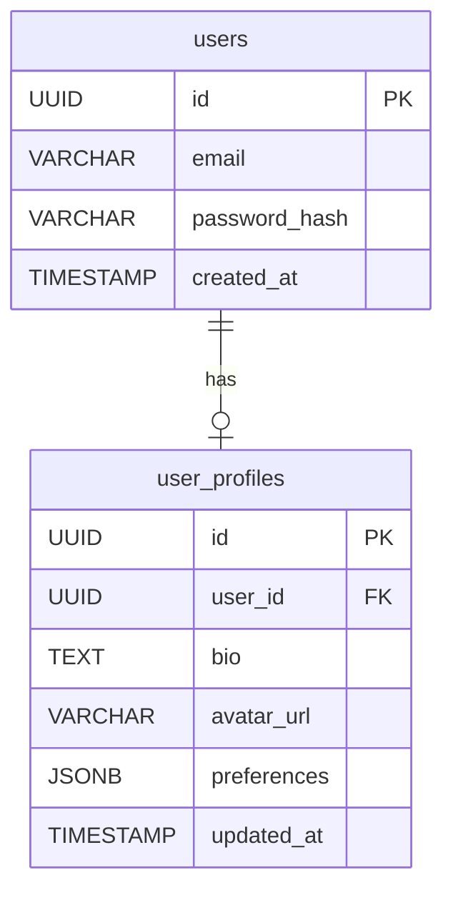

<objective>
Generate implementation plan with code reuse analysis from spec.md, ensuring alignment with project documentation and maximizing component reuse during the /plan workflow phase.

This skill orchestrates the /plan phase, which runs after /spec (or /clarify) and before /tasks in the feature workflow.

**Core responsibilities**:

- Load all 8 project documentation files from docs/project/ for constraint extraction
- Search codebase for similar features and reusable components (expect 5-15 opportunities)
- Design architecture with components, layers, and design patterns
- Plan data model with entities, relationships, and migrations
- Define API contracts in OpenAPI format (if applicable)
- Plan testing strategy (unit, integration, E2E)
- Estimate complexity (20-30 tasks predicted)

Inputs: spec.md (feature specification), docs/project/\*.md (8 files), existing codebase
Outputs: plan.md (implementation plan), research.md (reuse findings and project context)
Expected duration: 1-3 hours
</objective>

<quick_start>
Execute planning workflow systematically:

1. **Load Project Documentation** - Read all 8 docs/project/\*.md files for constraints (tech stack, architecture, data model, API patterns)
2. **Research Code Reuse** - Search codebase before designing (expect 5-15 reuse opportunities)
3. **Design Architecture** - Components, layers, design patterns (MVC, Repository, etc.)
4. **Plan Data Model** - Entities, relationships, ERD diagram, migrations
5. **Define API Contracts** - Endpoints, schemas, validation (OpenAPI format if applicable)
6. **Plan Testing Strategy** - Unit, integration, E2E coverage with specific test types
7. **Estimate Complexity** - Predict 20-30 tasks based on feature scope

Key principle: Research before designing. Maximize code reuse. Align with project documentation.

See resources/ directory for detailed workflows on each step.
</quick_start>

<prerequisites>
Before beginning planning phase:
- Specification phase completed (spec.md exists in specs/NNN-slug/)
- Feature requirements understood (success criteria, user stories, edge cases)
- Project documentation available (docs/project/*.md) OR brownfield codebase exists
- Git working tree clean (no uncommitted changes)

If specification incomplete, return to /spec or /clarify phase.
</prerequisites>

<workflow>
<step number="1">
**Load Project Documentation**

Read all 8 project documentation files for constraint extraction.

**Files to load** (from docs/project/):

- overview.md - Vision, users, scope, success metrics
- system-architecture.md - C4 diagrams, components, data flows
- tech-stack.md - Database, frontend, backend, deployment platform
- data-architecture.md - ERD, entity schemas, storage strategy
- api-strategy.md - REST/GraphQL patterns, auth, versioning
- capacity-planning.md - Scaling tier, cost model
- deployment-strategy.md - CI/CD pipeline, environments
- development-workflow.md - Git flow, PR process, testing strategy

**Extraction process**:

```bash
# Read all 8 project docs
for doc in docs/project/*.md; do
  echo "Reading: $doc"
  cat "$doc"
done

# Extract key constraints
TECH_STACK=$(grep -A 20 "Technology Stack" docs/project/tech-stack.md)
DATABASE=$(grep -A 5 "Database" docs/project/tech-stack.md)
ARCHITECTURE=$(grep -A 10 "Architecture Style" docs/project/system-architecture.md)
API_STYLE=$(grep -A 5 "API Style" docs/project/api-strategy.md)
```

**Brownfield fallback** (if docs/project/ missing):

- Scan package.json, requirements.txt for tech stack
- Analyze existing database migrations for data model
- Review existing API routes for patterns
- Infer architecture from directory structure

**Output**: Document constraints in research.md under "Project Context" section

See resources/project-docs-integration.md for complete extraction workflow.
</step>

<step number="2">
**Research Code Reuse**

Search codebase for similar features and reusable components before designing.

**Search strategy**:

```bash
# Search for similar features (by name similarity)
grep -r "authentication" src/
grep -r "user profile" src/
grep -r "dashboard" src/

# Search for reusable components (by function)
grep -r "class.*Service" src/  # Service layer
grep -r "export.*Repository" src/  # Repository pattern
grep -r "function validate" src/  # Validation utilities
grep -r "export.*schema" src/  # Data schemas
```

**Expected findings**: 5-15 reuse opportunities per feature

**Reuse categories**:

- **Services**: Authentication, validation, data transformation
- **Components**: Forms, tables, modals, buttons (UI)
- **Utilities**: Date formatting, error handling, logging
- **Schemas**: Database models, API contracts, validation rules
- **Patterns**: Repository pattern, middleware, hooks

**Documentation**:

```markdown
## Reuse Opportunities (research.md)

### Services (3 found)

- src/services/AuthService.ts - Reuse for user authentication flow
- src/services/ValidationService.ts - Reuse for form validation
- src/services/EmailService.ts - Reuse for notification emails

### Components (7 found)

- src/components/UserForm.tsx - Adapt for profile editing
- src/components/DataTable.tsx - Reuse for user list display
  ...
```

**Anti-pattern**: Designing from scratch without searching for reuse (wastes time, creates duplication)

See resources/code-reuse-analysis.md for search patterns and anti-duplication strategies.
</step>

<step number="3">
**Design Architecture**

Design component structure, layers, and design patterns.

**Layers** (typical web application):

- **Presentation Layer**: UI components, pages, forms
- **Business Logic Layer**: Services, domain logic, validation
- **Data Access Layer**: Repositories, database queries, ORM models
- **Integration Layer**: External APIs, third-party services

**Component design**:

```markdown
## Architecture (plan.md)

### Components

**Frontend** (Next.js):

- pages/users/profile.tsx - User profile page
- components/ProfileForm.tsx - Editable profile form
- hooks/useUser.ts - User data fetching hook

**Backend** (Node.js + Express):

- routes/users.ts - User API routes
- controllers/UserController.ts - Request handling logic
- services/UserService.ts - Business logic (validation, transformation)
- repositories/UserRepository.ts - Database access (PostgreSQL)

**Database**:

- users table - User data (id, name, email, password_hash)
- user_profiles table - Extended profile data (bio, avatar_url, preferences)
```

**Design patterns to follow** (from system-architecture.md):

- Repository pattern for data access
- Service layer for business logic
- Dependency injection for testability
- Middleware for cross-cutting concerns (auth, logging, error handling)

**Validation**: Architecture aligns with tech-stack.md and system-architecture.md constraints

See resources/architecture-planning.md for complete component design workflow.
</step>

<step number="4">
**Plan Data Model**

Design entities, relationships, and database migrations.

**Entity design**:

```markdown
## Data Model (plan.md)

### Entities

**users** (existing table - reuse):

- id (UUID, PK)
- email (VARCHAR, UNIQUE, NOT NULL)
- password_hash (VARCHAR, NOT NULL)
- created_at (TIMESTAMP, NOT NULL)

**user_profiles** (new table):

- id (UUID, PK)
- user_id (UUID, FK → users.id, UNIQUE, NOT NULL)
- bio (TEXT, NULLABLE)
- avatar_url (VARCHAR, NULLABLE)
- preferences (JSONB, NULLABLE)
- updated_at (TIMESTAMP, NOT NULL)
```

**ERD diagram** (Mermaid):



**Migrations**:

```sql
-- Migration: 2025-11-19-create-user-profiles.sql
CREATE TABLE user_profiles (
  id UUID PRIMARY KEY DEFAULT gen_random_uuid(),
  user_id UUID UNIQUE NOT NULL REFERENCES users(id) ON DELETE CASCADE,
  bio TEXT,
  avatar_url VARCHAR(500),
  preferences JSONB DEFAULT '{}',
  updated_at TIMESTAMP NOT NULL DEFAULT NOW()
);

CREATE INDEX idx_user_profiles_user_id ON user_profiles(user_id);
```

**Validation**: ERD aligns with data-architecture.md naming conventions and storage strategy

See resources/data-model-planning.md for complete entity design and migration workflow.
</step>

<step number="5">
**Define API Contracts**

Design API endpoints, request/response schemas, and validation rules.

**API design** (follows api-strategy.md patterns):

````markdown
## API Endpoints (plan.md)

### GET /api/users/:id/profile

**Description**: Fetch user profile by user ID
**Auth**: Required (JWT token)
**Request**: None
**Response** (200 OK):

```json
{
  "id": "uuid",
  "user_id": "uuid",
  "bio": "string",
  "avatar_url": "string",
  "preferences": {
    "theme": "dark",
    "notifications_enabled": true
  },
  "updated_at": "2025-11-19T10:00:00Z"
}
```
````

**Errors**: 401 Unauthorized, 404 Not Found

### PUT /api/users/:id/profile

**Description**: Update user profile
**Auth**: Required (JWT token, must own profile)
**Request**:

```json
{
  "bio": "string (max 500 chars)",
  "avatar_url": "string (valid URL)",
  "preferences": {
    "theme": "light|dark",
    "notifications_enabled": boolean
  }
}
```

**Response** (200 OK): Updated profile object
**Errors**: 400 Bad Request, 401 Unauthorized, 403 Forbidden, 404 Not Found

````

**OpenAPI specification** (if applicable):
- Generate OpenAPI 3.0 spec for all endpoints
- Include request/response schemas, validation rules, error codes
- Save to docs/api/openapi.yaml

**Validation**: API design follows api-strategy.md REST patterns, error handling (RFC 7807), and auth requirements

See resources/api-contracts.md for OpenAPI generation and contract-first development.
</step>

<step number="6">
**Plan Testing Strategy**

Define test coverage plan with specific test types.

**Testing layers** (from development-workflow.md):
```markdown
## Testing Strategy (plan.md)

### Unit Tests (80% coverage target)
**Backend**:
- UserService.ts - Business logic validation
  - test: updateProfile validates bio length (max 500 chars)
  - test: updateProfile validates avatar URL format
  - test: updateProfile preserves existing preferences when partial update
- UserRepository.ts - Database queries
  - test: findByUserId returns profile or null
  - test: updateProfile updates only provided fields

**Frontend**:
- ProfileForm.tsx - UI component behavior
  - test: validates bio length before submission
  - test: shows error message for invalid avatar URL
  - test: preserves unsaved changes on navigation away

### Integration Tests
**API Endpoints**:
- PUT /api/users/:id/profile
  - test: authenticated user can update own profile
  - test: user cannot update other user's profile (403)
  - test: invalid bio length returns 400 with error details

**Database**:
- User + UserProfile relationship
  - test: deleting user cascades to user_profiles
  - test: user can have only one profile (UNIQUE constraint)

### E2E Tests (Critical paths only)
- User updates profile bio and sees changes reflected
- User uploads avatar image and sees preview
- User changes theme preference and UI updates
````

**Coverage targets**:

- Unit tests: 80% coverage (business logic + UI components)
- Integration tests: All API endpoints + critical database operations
- E2E tests: 3-5 critical user journeys

**Validation**: Testing strategy aligns with development-workflow.md Definition of Done

See resources/testing-strategy.md for test type selection and coverage planning.
</step>

<step number="7">
**Estimate Complexity**

Predict task count based on feature scope (20-30 tasks expected).

**Estimation formula**:

```
Total Tasks = Frontend Tasks + Backend Tasks + Database Tasks + Testing Tasks + Documentation Tasks

Frontend Tasks = Components × 2 (implement + tests)
Backend Tasks = Endpoints × 3 (controller + service + tests)
Database Tasks = Tables × 2 (migration + tests)
Testing Tasks = Integration Tests + E2E Tests
Documentation Tasks = 1-2 (README, API docs)
```

**Example calculation**:

```markdown
## Complexity Estimate (research.md)

**Frontend**:

- 2 components (ProfileForm, ProfilePage) × 2 = 4 tasks

**Backend**:

- 2 endpoints (GET, PUT) × 3 = 6 tasks

**Database**:

- 1 table (user_profiles) × 2 = 2 tasks

**Testing**:

- 3 integration tests = 3 tasks
- 2 E2E tests = 2 tasks

**Documentation**:

- Update README = 1 task
- Update API docs = 1 task

**Total**: 19 tasks (within 20-30 range ✅)
```

**Complexity tiers**:

- Simple: 10-15 tasks (single component, 1-2 endpoints)
- Medium: 20-30 tasks (multiple components, 3-5 endpoints) ← Most features
- Complex: 40-60 tasks (multiple pages, 10+ endpoints, complex business logic)

**Validation**: Estimate aligns with feature scope from spec.md

See resources/complexity-estimation.md for detailed estimation formulas and calibration.
</step>

<step number="8">
**Create Planning Artifacts**

Generate plan.md and research.md with all findings.

**plan.md structure**:

```markdown
# Implementation Plan: [Feature Name]

## Architecture

[Component structure, layers, design patterns from Step 3]

## Data Model

[Entities, ERD, migrations from Step 4]

## API Endpoints

[Endpoint design, schemas, validation from Step 5]

## Testing Strategy

[Unit, integration, E2E tests from Step 6]

## Implementation Sequence

1. Database migration (user_profiles table)
2. Backend API endpoints (GET, PUT /api/users/:id/profile)
3. Frontend components (ProfileForm, ProfilePage)
4. Integration tests (API + database)
5. E2E tests (user journeys)
6. Documentation (README, API docs)
```

**research.md structure**:

```markdown
# Research Findings: [Feature Name]

## Project Context

[Constraints from 8 project docs - Step 1]

## Reuse Opportunities

[5-15 reusable components found - Step 2]

## Complexity Estimate

[Task count prediction - Step 7]

## Technical Decisions

- Database: PostgreSQL (from tech-stack.md)
- API: REST (from api-strategy.md)
- Auth: JWT (existing pattern from codebase)
- Frontend: Next.js + React (from tech-stack.md)
```

**Validation**: Both files created in specs/NNN-slug/ directory

See reference.md for complete artifact generation workflow.
</step>
</workflow>

<validation>
After planning phase, verify:

- plan.md created with architecture, components, API contracts, testing strategy
- research.md created with project context, reuse findings (5-15 opportunities), complexity estimate
- All 8 project docs read (or brownfield research complete if docs missing)
- Code reuse opportunities identified and documented
- Testing strategy defined (unit, integration, E2E with specific tests)
- Complexity estimated (20-30 tasks predicted)
- API contracts specified in OpenAPI format (if applicable)
- Data model ERD created with Mermaid diagram (if database changes)

Planning phase complete when all validation criteria met. Ready to proceed to /tasks phase.
</validation>

<anti_patterns>
<pitfall name="designing_without_research">
**❌ Don't**: Start designing architecture without searching for reusable code
**✅ Do**: Always search codebase first (Step 2), then design with reuse in mind

**Why**: Wastes time rebuilding existing components. Creates code duplication.

**Impact**:

- Duplicate code (DRY violations)
- Longer implementation time (build what exists)
- Inconsistent patterns (different auth flows, different validation)

**Example** (bad):

```
/plan starts immediately with architecture design
Designs new AuthService from scratch
Reality: src/services/AuthService.ts already exists (reusable)
Result: Duplicate AuthService, 4 hours wasted
```

**Example** (good):

```
/plan starts with code reuse search (Step 2)
Finds: src/services/AuthService.ts (reusable)
Designs: Extend AuthService with new method (not rebuild)
Result: 30 minutes work (vs 4 hours)
```

</pitfall>

<pitfall name="skipping_project_docs">
**❌ Don't**: Skip reading docs/project/*.md files (assume you know constraints)
**✅ Do**: Always load all 8 project docs first (Step 1)

**Why**: Hallucinate wrong technology choices. Violate project standards.

**Impact**:

- Wrong database choice (plan PostgreSQL, project uses MongoDB)
- Wrong API style (plan GraphQL, project uses REST)
- Wrong architecture (plan microservices, project is monolith)

**Example** (bad):

```
/plan skips project docs loading
Plans: GraphQL API with MongoDB
Reality: tech-stack.md specifies REST + PostgreSQL
Result: Entire plan must be redone (2-3 hours wasted)
```

**Example** (good):

```
/plan loads tech-stack.md first (Step 1)
Reads: Database = PostgreSQL, API = REST
Plans: REST API with PostgreSQL (aligned)
Result: Plan approved on first review
```

</pitfall>

<pitfall name="vague_testing_strategy">
**❌ Don't**: "Write tests" without specific test types and coverage targets
**✅ Do**: Define specific unit, integration, E2E tests with coverage targets (Step 6)

**Why**: No clear Definition of Done. Implementation phase lacks test guidance.

**Impact**:

- Low test coverage (<50% vs 80% target)
- Missing integration tests (only unit tests)
- No E2E tests for critical user journeys

**Example** (bad):

```
Testing Strategy: "Write unit tests for all components"
Implementation phase: Unclear what to test, how much coverage needed
Result: 45% coverage, missing integration tests
```

**Example** (good):

```
Testing Strategy:
- Unit: UserService.updateProfile validates bio length (80% coverage)
- Integration: PUT /api/users/:id/profile with auth
- E2E: User updates profile and sees changes
Implementation phase: Clear guidance, all tests implemented
Result: 85% coverage, all test types covered
```

</pitfall>

<pitfall name="no_complexity_estimate">
**❌ Don't**: Skip task count prediction (proceed to /tasks without estimate)
**✅ Do**: Predict 20-30 tasks based on feature scope (Step 7)

**Why**: No velocity tracking. Can't detect scope creep.

**Impact**:

- Scope creep undetected (planned 20 tasks, actual 60 tasks)
- Can't validate /tasks output (is 45 tasks reasonable?)
- No burndown tracking (unknown if on schedule)

**Example** (bad):

```
/plan: No complexity estimate
/tasks: Generates 45 tasks
Question: "Is 45 tasks reasonable for this feature?"
Answer: Unknown (no baseline estimate)
```

**Example** (good):

```
/plan: Estimates 20-30 tasks (Step 7)
/tasks: Generates 45 tasks
Red flag: 45 > 30 (scope creep detected)
Action: Review tasks, remove unnecessary work
Result: 28 tasks (aligned with estimate)
```

</pitfall>

<pitfall name="missing_api_contracts">
**❌ Don't**: "Design API endpoints" without request/response schemas
**✅ Do**: Specify complete API contracts with schemas, validation, errors (Step 5)

**Why**: Frontend/backend integration bugs. No clear contract to test against.

**Impact**:

- Integration bugs (frontend expects field A, backend returns field B)
- Ambiguous validation (is bio max 500 or 1000 chars?)
- No contract tests (can't validate API compliance)

**Example** (bad):

```
API Endpoints: "GET /api/users/:id/profile - Returns user profile"
Implementation: Frontend expects { bio, avatar }, backend returns { description, image }
Result: Integration bug, 2 hours debugging
```

**Example** (good):

```
API Endpoints:
GET /api/users/:id/profile
Response: { "bio": string, "avatar_url": string, "preferences": object }
Validation: bio max 500 chars, avatar_url must be valid URL
Implementation: Frontend and backend aligned on contract
Result: Zero integration bugs
```

</pitfall>
</anti_patterns>

<best_practices>
<practice name="research_first_design_second">
Always search for reusable code before designing:

1. Search codebase for similar features (Step 2)
2. Identify 5-15 reuse opportunities
3. Design with reuse in mind (extend, not rebuild)

Result: Faster implementation, less duplication, consistent patterns
</practice>

<practice name="project_docs_first">
Load all 8 project documentation files first:

1. Read docs/project/\*.md for constraints (Step 1)
2. Extract tech stack, architecture, API patterns
3. Align plan with documented standards

Result: No hallucinated tech choices, compliant architecture
</practice>

<practice name="specific_testing_strategy">
Define specific tests with coverage targets:

1. Unit tests: 80% coverage with specific test cases
2. Integration tests: All API endpoints + critical database operations
3. E2E tests: 3-5 critical user journeys

Result: Clear Definition of Done, comprehensive test coverage
</practice>

<practice name="estimate_complexity">
Predict task count before /tasks phase:

1. Calculate: Frontend + Backend + Database + Testing + Documentation
2. Expect: 20-30 tasks for medium features
3. Use estimate to validate /tasks output

Result: Detect scope creep, track velocity, validate task breakdown
</practice>

<practice name="complete_api_contracts">
Specify complete API contracts with schemas:

1. Request/response schemas in JSON format
2. Validation rules (max length, regex, required fields)
3. Error codes (400, 401, 403, 404)
4. OpenAPI spec if applicable

Result: Zero integration bugs, contract-first development
</practice>
</best_practices>

<success_criteria>
Planning phase complete when:

- [ ] plan.md created with architecture, components, API contracts, testing strategy, implementation sequence
- [ ] research.md created with project context (8 docs), reuse findings (5-15 opportunities), complexity estimate (20-30 tasks)
- [ ] All 8 project docs read (overview, architecture, tech-stack, data, API, capacity, deployment, workflow)
- [ ] Code reuse opportunities identified and documented (5-15 expected)
- [ ] Testing strategy defined (unit 80% coverage, integration all endpoints, E2E 3-5 journeys)
- [ ] Complexity estimated (20-30 tasks predicted)
- [ ] API contracts specified with request/response schemas, validation, errors
- [ ] Data model ERD created with Mermaid diagram (if database changes)
- [ ] state.yaml updated (planning.status = completed)

Ready to proceed to /tasks phase for task breakdown.
</success_criteria>

<quality_standards>
**Good planning**:

- Research-first (5-15 reuse opportunities identified)
- Project-aligned (reads all 8 docs, follows constraints)
- Specific testing strategy (named test cases, 80% coverage target)
- Complexity estimated (20-30 tasks predicted)
- Complete API contracts (schemas, validation, errors)
- ERD diagram for data model (Mermaid format)

**Bad planning**:

- Design-first (skips reuse search, duplicates code)
- Hallucinated tech (ignores project docs, wrong database)
- Vague testing ("write tests" with no specifics)
- No complexity estimate (scope creep undetected)
- Incomplete API contracts (no schemas, no validation)
- No ERD (entity relationships unclear)
  </quality_standards>

<troubleshooting>
**Issue**: Can't find docs/project/*.md files
**Solution**: Brownfield fallback - scan package.json, migrations, existing routes for tech stack and patterns

**Issue**: Found <5 reuse opportunities (expected 5-15)
**Solution**: Expand search - try broader keywords, search for design patterns (Repository, Service), check dependencies

**Issue**: Complexity estimate >50 tasks (expected 20-30)
**Solution**: Feature too large - split into multiple features, remove nice-to-have requirements, simplify scope

**Issue**: API contract doesn't match existing patterns
**Solution**: Review api-strategy.md and existing endpoints for consistent patterns, align with project standards

**Issue**: ERD too complex (>10 entities for single feature)
**Solution**: Scope too large - split into multiple features, or some entities already exist (check data-architecture.md)
</troubleshooting>

<reference_guides>
Planning procedures:

- Project Docs Integration (resources/project-docs-integration.md) - Load 8 project docs workflow
- Code Reuse Analysis (resources/code-reuse-analysis.md) - Anti-duplication search patterns
- Architecture Planning (resources/architecture-planning.md) - Component design, layers, patterns

Planning artifacts:

- Data Model Planning (resources/data-model-planning.md) - Entity design, ERD, migrations
- API Contracts (resources/api-contracts.md) - OpenAPI specs, endpoint design
- Testing Strategy (resources/testing-strategy.md) - Coverage plan, test types

Estimation & validation:

- Complexity Estimation (resources/complexity-estimation.md) - Task count prediction formulas
- Common Mistakes (resources/common-mistakes.md) - Anti-patterns to avoid

Examples:

- Good vs Bad Planning (examples.md) - Real examples from actual planning sessions

Next phase:
After planning completes → /tasks (break down into 20-30 concrete implementation tasks)
</reference_guides>
