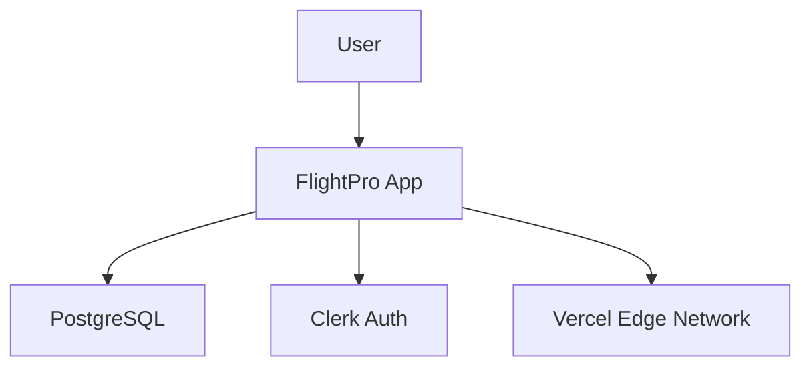
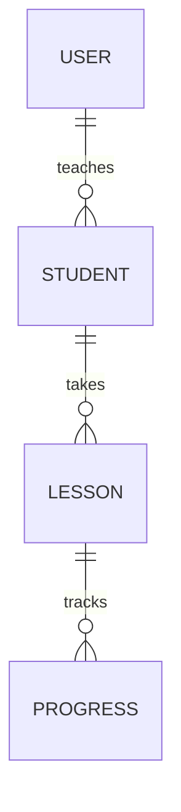

<objective>
Guide execution of the /init-project command to generate 8 comprehensive project-level design documents through interactive questionnaire, brownfield codebase scanning, and cross-document consistency validation. Embodies "Planning is 80% of the project, 20% code" philosophy.

This skill orchestrates one-time project setup, producing foundation documentation that all features must align with.

**Core responsibilities**:
- Detect project type (greenfield vs brownfield)
- Run interactive questionnaire (15 questions covering vision, scale, tech stack, constraints)
- Scan existing codebase (if brownfield) to auto-fill docs
- Launch project-architect agent to generate 8 documentation files
- Validate cross-document consistency
- Present summary with [NEEDS CLARIFICATION] count

Inputs: User answers (15 questions), existing codebase (if brownfield), templates from `.spec-flow/templates/project/`
Outputs: 8 markdown files in `docs/project/` (overview, architecture, tech-stack, data, API, capacity, deployment, workflow)
Expected duration: 15-20 minutes (10 min questions + 5-10 min generation/review)
</objective>

<quick_start>
Execute /init-project workflow in 6 steps:

1. **Detect project type** - Check for package.json, requirements.txt, etc. (greenfield vs brownfield)
2. **Interactive questionnaire** - Ask 15 questions (project name, vision, scale, tech stack, constraints)
3. **Brownfield scanning** (if applicable) - Auto-detect tech stack, ERD from migrations, architecture pattern
4. **Launch project-architect agent** - Generate 8 docs from templates + answers + scan results
5. **Validate documentation** - Verify all 8 files exist, [NEEDS CLARIFICATION] count < 20, Mermaid diagrams present
6. **Summary report** - Show coverage (greenfield: 70% filled, brownfield: 80% filled), next steps

Key principle: Mark unknowns with [NEEDS CLARIFICATION] instead of hallucinating.
</quick_start>

<success_criteria>
Project initialization phase complete when:

- [ ] All 8 files generated in `docs/project/` (overview, system-architecture, tech-stack, data-architecture, api-strategy, capacity-planning, deployment-strategy, development-workflow)
- [ ] [NEEDS CLARIFICATION] count < 20 (indicates good coverage from questionnaire/scan)
- [ ] Mermaid diagrams present and valid (C4 in system-architecture, ERD in data-architecture)
- [ ] Cross-document consistency validated (tech stack, database, deployment model aligned)
- [ ] Tech stack accurately detected (brownfield only)
- [ ] User informed of next steps (review docs, fill clarifications, commit)

If [NEEDS CLARIFICATION] count > 30, re-run questionnaire with more detailed answers or manually fill post-generation.
</success_criteria>

<prerequisites>
**Environment checks**:
- Templates exist in `.spec-flow/templates/project/` (8 files: overview-template, system-architecture-template, etc.)
- `docs/` directory exists or can be created
- Project-architect agent available at `.claude/agents/phase/project-architect.md`

**Knowledge requirements**:
- Understanding of greenfield vs brownfield projects
- Familiarity with tech stack detection strategies (package.json, requirements.txt parsing)
- ERD generation from database migrations (Alembic, Prisma)
- Cross-document consistency validation patterns

**Before running**:
⚠️ **WARNING**: /init-project generates 8 files in `docs/project/`. If directory already exists, offer user to:
- A) Backup existing docs to `docs/project-backup-{timestamp}/`
- B) Append to existing docs (merge new sections)
- C) Abort (user will manually update)
</prerequisites>

<workflow>
<step number="1">
**Detect Project Type (Greenfield vs Brownfield)**

Determine if starting from scratch (greenfield) or with existing codebase (brownfield).

**Detection Logic**:

```bash
# Check for existing codebase indicators
if [ -f "package.json" ]; then
  PROJECT_TYPE="brownfield"
  TECH_DETECTED="Node.js"
elif [ -f "requirements.txt" ] || [ -f "pyproject.toml" ]; then
  PROJECT_TYPE="brownfield"
  TECH_DETECTED="Python"
elif [ -f "Cargo.toml" ]; then
  PROJECT_TYPE="brownfield"
  TECH_DETECTED="Rust"
elif [ -f "go.mod" ]; then
  PROJECT_TYPE="brownfield"
  TECH_DETECTED="Go"
elif [ -f "Gemfile" ]; then
  PROJECT_TYPE="brownfield"
  TECH_DETECTED="Ruby"
else
  PROJECT_TYPE="greenfield"
fi
```

**Inform user**:

```bash
if [ "$PROJECT_TYPE" = "brownfield" ]; then
  echo "✅ Detected existing codebase ($TECH_DETECTED)"
  echo "   Will scan codebase to auto-fill project docs"
else
  echo "ℹ️  No existing codebase detected (greenfield project)"
  echo "   Will generate templates with [NEEDS CLARIFICATION] markers"
fi
```

**Quality check**: Correct project type detected? If unclear (e.g., multiple languages), ask user which is primary.
</step>

<step number="2">
**Interactive Questionnaire (15 Questions)**

Gather essential project context to fill documentation templates.

**Question Flow** (full list in reference.md):

```bash
# Q1: Project name
read -p "Q1. Project name (e.g., FlightPro): " PROJECT_NAME

# Q2: Vision (1 sentence)
read -p "Q2. Vision - What problem does this solve? (1 sentence): " VISION

# Q3: Primary users
read -p "Q3. Primary users (e.g., CFIs, students): " PRIMARY_USERS

# Q4: Scale tier
echo "Q4. Scale tier:"
echo "   1) Micro (100 users, $40/mo)"
echo "   2) Small (1K users, $95/mo)"
echo "   3) Medium (10K users, $415/mo)"
echo "   4) Large (100K+ users, $2K+/mo)"
read -p "   Choice (1-4): " SCALE_CHOICE
case $SCALE_CHOICE in
  1) SCALE="micro" ;;
  2) SCALE="small" ;;
  3) SCALE="medium" ;;
  4) SCALE="large" ;;
esac

# Q5-Q15: Team size, architecture style, database, deployment platform,
#         API style, auth provider, budget, privacy, git workflow,
#         deployment model, frontend framework
```

**Validation**:
- Required: PROJECT_NAME, VISION, PRIMARY_USERS
- Optional (can be "unknown" or "TBD"): Budget, specific versions

**Store answers**:

```bash
# Save to temporary file for project-architect agent
cat > /tmp/project-init-answers.json <<EOF
{
  "project_name": "$PROJECT_NAME",
  "vision": "$VISION",
  "primary_users": "$PRIMARY_USERS",
  "scale": "$SCALE",
  "team_size": "$TEAM_SIZE",
  "architecture": "$ARCHITECTURE",
  "database": "$DATABASE",
  "deployment_platform": "$DEPLOYMENT_PLATFORM",
  "api_style": "$API_STYLE",
  "auth_provider": "$AUTH_PROVIDER",
  "budget_monthly": "$BUDGET",
  "privacy_reqs": "$PRIVACY",
  "git_workflow": "$GIT_WORKFLOW",
  "deployment_model": "$DEPLOYMENT_MODEL",
  "frontend_framework": "$FRONTEND"
}
EOF
```

**Quality check**: All required fields filled? User satisfied with answers?
</step>

<step number="3">
**Brownfield Codebase Scanning** (Skip if greenfield)

Auto-detect tech stack, architecture patterns, and generate ERD from migrations.

**Tech Stack Scanning**:

```bash
# Frontend detection
if [ -f "package.json" ]; then
  # Detect Next.js
  if grep -q '"next":' package.json; then
    FRONTEND_FRAMEWORK=$(jq -r '.dependencies.next // .devDependencies.next' package.json)
  fi

  # Detect React
  if grep -q '"react":' package.json; then
    REACT_VERSION=$(jq -r '.dependencies.react' package.json)
  fi

  # Detect TypeScript
  if grep -q '"typescript":' package.json; then
    TS_DETECTED=true
  fi
fi

# Backend detection
if [ -f "requirements.txt" ]; then
  # Detect FastAPI
  if grep -q 'fastapi' requirements.txt; then
    BACKEND_FRAMEWORK="FastAPI"
    BACKEND_VERSION=$(grep 'fastapi' requirements.txt | grep -o '[0-9]\+\.[0-9]\+\.[0-9]\+')
  fi

  # Detect Django
  if grep -q 'django' requirements.txt; then
    BACKEND_FRAMEWORK="Django"
  fi
fi

# Database detection (from dependencies)
if grep -q '"pg":' package.json || grep -q 'psycopg2' requirements.txt; then
  DATABASE="PostgreSQL"
fi

# Database detection (from migrations)
if [ -d "alembic/versions" ]; then
  DATABASE_MIGRATION_TOOL="Alembic"
  MIGRATION_COUNT=$(ls alembic/versions/*.py 2>/dev/null | wc -l)
fi
```

**Architecture Pattern Detection**:

```bash
# Detect microservices
if [ -d "services" ] || [ -d "microservices" ]; then
  ARCHITECTURE="microservices"
elif [ -f "docker-compose.yml" ]; then
  # Check for multiple services in docker-compose
  SERVICE_COUNT=$(grep -c 'image:' docker-compose.yml)
  if [ "$SERVICE_COUNT" -gt 2 ]; then
    ARCHITECTURE="microservices"
  fi
else
  ARCHITECTURE="monolith"
fi
```

**Deployment Platform Detection**:

```bash
if [ -f "vercel.json" ]; then
  DEPLOYMENT_PLATFORM="Vercel"
elif [ -f "railway.json" ] || [ -f "railway.toml" ]; then
  DEPLOYMENT_PLATFORM="Railway"
elif [ -d ".github/workflows" ]; then
  # Inspect deploy workflow for platform
  WORKFLOW_FILE=$(find .github/workflows -name "*deploy*" -type f | head -1)
  if grep -q 'vercel' "$WORKFLOW_FILE"; then
    DEPLOYMENT_PLATFORM="Vercel"
  elif grep -q 'railway' "$WORKFLOW_FILE"; then
    DEPLOYMENT_PLATFORM="Railway"
  fi
fi
```

**ERD Generation from Migrations**:

```bash
# If Alembic migrations exist, generate ERD
if [ -d "alembic/versions" ]; then
  # Scan migration files for create_table statements
  ENTITIES=()
  for migration in alembic/versions/*.py; do
    # Extract table names
    TABLE_NAME=$(grep -oP "create_table\('\K[^']+" "$migration")
    if [ -n "$TABLE_NAME" ]; then
      ENTITIES+=("$TABLE_NAME")
    fi
  done

  # Result: ENTITIES=("users" "students" "lessons" "progress")
fi
```

**Quality check**: Tech stack accurately detected? ERD entities match database schema?
</step>

<step number="4">
**Launch Project-Architect Agent**

Invoke specialized agent to generate 8 documentation files.

**Agent Invocation**:

```bash
# Pass answers + scan results to project-architect agent
# Agent responsibilities:
# - Read 8 templates from .spec-flow/templates/project/
# - Fill templates with questionnaire answers
# - Inject scan results (if brownfield)
# - Mark unknowns with [NEEDS CLARIFICATION]
# - Generate Mermaid diagrams (C4, ERD)
# - Validate cross-document consistency
# - Write 8 files to docs/project/
```

**Monitor progress**:

```bash
echo "🤖 Project-architect agent generating documentation..."
echo "   - Reading 8 templates"
echo "   - Filling with questionnaire answers"
echo "   - Injecting scan results (brownfield)"
echo "   - Generating Mermaid diagrams"
echo "   - Validating cross-document consistency"
```

**Quality check**: Agent completed successfully? No errors during generation?
</step>

<step number="5">
**Validate Generated Documentation**

Verify all files exist, check quality metrics, validate Mermaid diagrams.

**File Existence Check**:

```bash
DOCS_DIR="docs/project"
REQUIRED_FILES=(
  "overview.md"
  "system-architecture.md"
  "tech-stack.md"
  "data-architecture.md"
  "api-strategy.md"
  "capacity-planning.md"
  "deployment-strategy.md"
  "development-workflow.md"
)

for file in "${REQUIRED_FILES[@]}"; do
  if [ ! -f "$DOCS_DIR/$file" ]; then
    echo "❌ Missing file: $DOCS_DIR/$file"
    exit 1
  fi
done

echo "✅ All 8 documentation files generated"
```

**Quality Metrics**:

```bash
# Count [NEEDS CLARIFICATION] markers
CLARIFICATION_COUNT=$(grep -r "NEEDS CLARIFICATION" "$DOCS_DIR" | wc -l)
echo "ℹ️  Found $CLARIFICATION_COUNT [NEEDS CLARIFICATION] sections"

# Validate Mermaid diagrams
if grep -q '```mermaid' "$DOCS_DIR/system-architecture.md"; then
  echo "✅ Mermaid diagrams present in system-architecture.md"
else
  echo "⚠️  Warning: No Mermaid diagrams in system-architecture.md"
fi

# Cross-document consistency check
# - Tech stack in tech-stack.md matches system-architecture.md
# - Database in tech-stack.md matches data-architecture.md
# - Deployment model in deployment-strategy.md matches capacity-planning.md
```

**Quality Standards**:
- All 8 files generated: ✅
- [NEEDS CLARIFICATION] count < 20: ✅ (good coverage)
- Mermaid diagrams present: ✅
- Cross-document consistency: ✅
</step>

<step number="6">
**Summary Report**

Display generation results and guide user to next steps.

**Summary Display**:

```bash
echo "━━━━━━━━━━━━━━━━━━━━━━━━━━━━━━━━━━━━━━━━"
echo "✅ PROJECT DOCUMENTATION GENERATED"
echo "━━━━━━━━━━━━━━━━━━━━━━━━━━━━━━━━━━━━━━━━"
echo ""
echo "📊 Coverage:"
if [ "$PROJECT_TYPE" = "greenfield" ]; then
  echo "   - Filled from questionnaire: 70%"
  echo "   - Inferred from defaults: 10%"
  echo "   - Needs clarification: 20%"
else
  echo "   - Filled from questionnaire: 50%"
  echo "   - Inferred from codebase: 30%"
  echo "   - Needs clarification: 20%"
fi
echo ""
echo "📍 [NEEDS CLARIFICATION] Sections: $CLARIFICATION_COUNT"
if [ "$CLARIFICATION_COUNT" -gt 0 ]; then
  echo "   Review and fill these sections:"
  grep -r "NEEDS CLARIFICATION" docs/project/ --with-filename | head -5
  echo "   ..."
fi
echo ""
echo "✅ Generated Files:"
for file in "${REQUIRED_FILES[@]}"; do
  echo "   - docs/project/$file"
done
echo ""
echo "💡 Next Steps:"
echo "   1. Review docs/project/ files"
echo "   2. Fill [NEEDS CLARIFICATION] sections"
echo "   3. Commit: git add docs/project/ && git commit -m 'docs: add project architecture'"
echo "   4. Start building: /roadmap or /feature"
echo ""
```

**Quality check**: User understands next steps? Documentation looks complete?
</step>
</workflow>

<validation>
After completing workflow, verify:

- All 8 files exist in `docs/project/` with reasonable file sizes (not empty)
- [NEEDS CLARIFICATION] markers are specific (e.g., "[NEEDS CLARIFICATION: Who are your main competitors?]" not just "[TODO]")
- Mermaid diagrams use valid syntax (run through Mermaid validator if available)
- Cross-document references align:
  - Tech stack mentioned in multiple docs is consistent
  - Database choice appears in tech-stack.md, data-architecture.md, capacity-planning.md
  - Deployment model in deployment-strategy.md matches capacity-planning.md cost model
- Brownfield scan results (if applicable) accurately reflect codebase
- No Lorem Ipsum or generic placeholder text
- User has clear understanding of what to do next
</validation>

<anti_patterns>
<pitfall name="hallucinating_business_logic">
**❌ Don't**: Make up features, user metrics, or competitor names not provided by user
**✅ Do**: Use [NEEDS CLARIFICATION] for unknowns

**Why**: Documentation must reflect actual project, not assumptions. Hallucinated details lead to misalignment.

**Example** (bad):
```markdown
## Competitors
- Foreflight (market leader, $250/year)
- CloudAhoy ($99/year)
- ForeFlight Pro ($500/year)
```
**User never mentioned these!**

**Example** (good):
```markdown
## Competitors
[NEEDS CLARIFICATION: Who are your main competitors? What features do they lack that you'll provide?]
```
</pitfall>

<pitfall name="skipping_codebase_scan">
**❌ Don't**: Skip brownfield scanning even when codebase exists
**✅ Do**: Always scan for tech stack, ERD, architecture patterns

**Why**: Auto-detection saves time and reduces [NEEDS CLARIFICATION] markers by 20-30%.

**Example** (bad):
```
Detected brownfield project
Skipping scan (takes too long)
Result: 35 [NEEDS CLARIFICATION] markers
```

**Example** (good):
```
Detected brownfield project
Scanning package.json... Found Next.js 14, React 18, TypeScript
Scanning alembic/versions... Found User, Student, Lesson entities
Result: 12 [NEEDS CLARIFICATION] markers (67% reduction)
```
</pitfall>

<pitfall name="vague_clarification_markers">
**❌ Don't**: Use generic "[TODO]" or "[FILL THIS]" placeholders
**✅ Do**: Use specific [NEEDS CLARIFICATION: question] markers

**Why**: Specific questions guide user to fill gaps correctly.

**Example** (bad):
```markdown
## Performance Targets
- API response time: [TODO]
- Database query time: [FILL THIS]
```

**Example** (good):
```markdown
## Performance Targets
- API response time: [NEEDS CLARIFICATION: p95 < 500ms? 1s? 2s?]
- Database query time: [NEEDS CLARIFICATION: What's acceptable for complex joins? <100ms? <500ms?]
```
</pitfall>

<pitfall name="ignoring_questionnaire_answers">
**❌ Don't**: Re-ask questions already answered in questionnaire
**✅ Do**: Use questionnaire answers verbatim, cite source

**Why**: Wastes user time, creates inconsistencies.

**Example** (bad):
```
Questionnaire Q7: Database = PostgreSQL
Generated doc: "Database: [NEEDS CLARIFICATION: What database?]"
```

**Example** (good):
```
Questionnaire Q7: Database = PostgreSQL
Generated doc: "Database: PostgreSQL (from questionnaire Q7)"
```
</pitfall>

<pitfall name="missing_cross_document_validation">
**❌ Don't**: Generate 8 docs without checking consistency
**✅ Do**: Validate tech stack, database, deployment model align across docs

**Why**: Inconsistencies confuse developers, lead to architectural mismatches.

**Example** (bad):
```
tech-stack.md: Database = PostgreSQL
data-architecture.md: Database = MongoDB (conflict!)
```

**Example** (good):
```
tech-stack.md: Database = PostgreSQL
data-architecture.md: Database = PostgreSQL (consistent)
capacity-planning.md: Database costs = PostgreSQL pricing (consistent)
```
</pitfall>
</anti_patterns>

<best_practices>
<practice name="cite_sources">
Always cite where information came from (questionnaire, scan, inference, default).

**Example**:
```markdown
## Tech Stack

**Backend**: FastAPI (detected from requirements.txt v0.109.0)
**Frontend**: Next.js 14 (detected from package.json)
**Database**: PostgreSQL (from questionnaire Q7)
**Architecture**: Monolith (inferred from team size: solo developer)
**Deployment**: Vercel (from questionnaire Q8)
```

**Benefit**: Transparency shows which answers need verification vs which are confirmed.
</practice>

<practice name="specific_clarification_questions">
Make [NEEDS CLARIFICATION] markers actionable with specific questions.

**Example**:
```markdown
## Success Metrics

- Monthly Active Users (MAU): [NEEDS CLARIFICATION: What's your target MAU at 6 months? 12 months?]
- Conversion rate: [NEEDS CLARIFICATION: What % of signups should convert to paid within 30 days?]
- Churn rate: [NEEDS CLARIFICATION: What monthly churn rate is acceptable? <5%? <10%?]
```

**Benefit**: User knows exactly what information is needed, not guessing.
</practice>

<practice name="brownfield_scan_first">
For brownfield projects, scan codebase before filling templates to maximize auto-fill.

**Workflow**:
1. Detect project type
2. If brownfield: scan tech stack, ERD, architecture BEFORE questionnaire
3. Pre-fill questionnaire with scan results (user can override)
4. Generate docs with combined questionnaire + scan data

**Benefit**: Reduces user effort, increases accuracy, lowers [NEEDS CLARIFICATION] count.
</practice>

<practice name="mermaid_diagrams_required">
Always generate Mermaid diagrams for system-architecture.md and data-architecture.md.

**System Architecture** (C4 Context diagram):


**Data Architecture** (ERD):


**Benefit**: Visual diagrams clarify architecture, catch design issues early.
</practice>

<practice name="validate_before_write">
Run cross-document consistency checks before writing files.

**Validation Script**:
```bash
# Extract database from tech-stack.md
TECH_DB=$(grep "Database:" docs/project/tech-stack.md | awk '{print $2}')

# Extract database from data-architecture.md
DATA_DB=$(grep "Database:" docs/project/data-architecture.md | awk '{print $2}')

# Compare
if [ "$TECH_DB" != "$DATA_DB" ]; then
  echo "❌ Inconsistency: tech-stack says $TECH_DB, data-architecture says $DATA_DB"
  exit 1
fi
```

**Benefit**: Prevents shipping inconsistent documentation, saves time fixing later.
</practice>
</best_practices>

<quality_standards>
**Good project initialization**:
- All 8 files generated with meaningful content (not just templates)
- [NEEDS CLARIFICATION] count < 20 (indicates 80%+ coverage)
- Every [NEEDS CLARIFICATION] has specific question
- Mermaid diagrams present and syntactically valid
- Cross-document consistency validated (tech stack, database, deployment model)
- Brownfield scan (if applicable) accurately detected 70%+ of tech stack
- User clearly understands next steps (review, fill, commit)
- Reasonable defaults used (e.g., monolith for solo dev, PostgreSQL for relational)
- Sources cited (questionnaire Q7, detected from package.json, inferred from X)

**Bad project initialization**:
- Generic templates with [TODO] placeholders
- [NEEDS CLARIFICATION] count > 30 (poor coverage, mostly empty)
- Vague markers ("[TODO fill this later]")
- No Mermaid diagrams (all-text architecture descriptions)
- Conflicting info across docs (PostgreSQL in one, MongoDB in another)
- Brownfield scan skipped or inaccurate (wrong tech stack detected)
- No next steps provided
- Hallucinated details (made-up competitors, features, metrics)
- No source citations (can't tell what's from user vs inferred)
</quality_standards>

<troubleshooting>
**Issue**: "Too many [NEEDS CLARIFICATION] markers (>30)"
- **Cause**: Greenfield project + incomplete questionnaire answers
- **Fix**: Re-run /init-project with more detailed answers, OR manually fill clarifications post-generation

**Issue**: "Brownfield scan detected wrong tech stack"
- **Cause**: Multiple tech stacks in monorepo, or scan logic error
- **Fix**: Manually edit `docs/project/tech-stack.md` after generation, verify package.json/requirements.txt

**Issue**: "ERD generation failed (no entities)"
- **Cause**: Migration files not in expected format (not Alembic/Prisma), or custom migration tool
- **Fix**: Manually create ERD in `data-architecture.md` using Mermaid syntax, reference database schema

**Issue**: "Cross-document inconsistencies detected"
- **Cause**: Questionnaire answers conflict (e.g., said "PostgreSQL" but scan found "MongoDB")
- **Fix**: Review validation output, manually resolve conflicts in generated docs, update questionnaire answers

**Issue**: "Missing template files"
- **Cause**: Spec-Flow package not installed correctly, or templates deleted
- **Fix**: Run `git pull origin main` to get latest templates, or reinstall workflow package

**Issue**: "Agent failed to generate docs"
- **Cause**: Out of memory (8 docs is token-heavy), or template malformed
- **Fix**: Check agent logs, verify template syntax, increase token budget, run generation sequentially not parallel
</troubleshooting>

<reference_guides>
Supporting documentation:
- **15 Questions Mapping** (reference.md) - What each question maps to in generated docs
- **Brownfield Scanning** (reference.md) - Tech stack detection patterns for Node.js, Python, Rust, Go
- **ERD Generation** (reference.md) - Parsing Alembic/Prisma migrations to generate Mermaid ERDs
- **Cross-Document Consistency** (reference.md) - Validation rules for aligning tech stack across 8 docs
- **[NEEDS CLARIFICATION] Standards** (reference.md) - When to use markers, how to phrase questions

Next steps after /init-project:
- Review generated docs in `docs/project/`
- Fill [NEEDS CLARIFICATION] sections with project-specific details
- Commit to repository: `git add docs/project/ && git commit -m "docs: add project architecture"`
- Start building features: Run `/roadmap` to plan features, or `/feature "name"` to implement first feature
</reference_guides>
