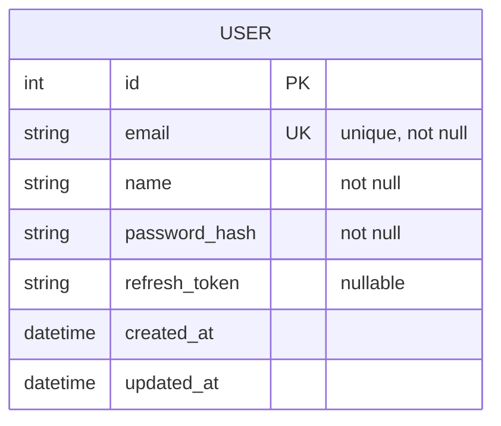

# Planning Phase Examples

<good_plan_example>
**Feature**: User Authentication System

**Scenario**: Planning a complete authentication feature with signup, login, and password reset

**Context**:
- Project uses Next.js 14, PostgreSQL, Prisma ORM (from tech-stack.md)
- Existing User model with email field (from data-architecture.md)
- API follows REST with JWT tokens (from api-strategy.md)

---

## Step 1: Load Project Documentation ✅

```bash
# Read all 8 project docs
Read docs/project/overview.md
Read docs/project/system-architecture.md
Read docs/project/tech-stack.md      # PostgreSQL + Prisma + Next.js
Read docs/project/data-architecture.md  # User model exists
Read docs/project/api-strategy.md    # REST + JWT
Read docs/project/capacity-planning.md
Read docs/project/deployment-strategy.md
Read docs/project/development-workflow.md
```

**Extracted Constraints**:
- Backend: Next.js API routes (not separate FastAPI)
- Database: PostgreSQL with Prisma ORM
- Auth: JWT tokens (access + refresh)
- API versioning: /api/v1/*
- Error format: RFC 7807 Problem Details

---

## Step 2: Research Code Reuse ✅

```bash
# Search for existing auth code
grep -r "authentication\|login\|auth" src/ --include="*.ts"
grep -r "class.*User\|interface.*User" src/models/

# Results:
Found: src/models/User.ts (User model with id, email, name)
Found: src/utils/validation.ts (emailValidator, passwordValidator)
Not found: Auth service (need to build)
Not found: JWT utilities (need to build)
```

**Reuse Opportunities**:
1. **User model** (src/models/User.ts) - Extend with password_hash field
2. **Email validator** (src/utils/validation.ts) - Reuse in signup form
3. **Password validator** (src/utils/validation.ts) - Reuse in signup form

**Time Saved**: 3 hours (avoid rebuilding validation, model)

---

## Step 3: Design Architecture ✅

**Components**:

**Backend** (Next.js API routes):
- **Models**: User (extend existing with password_hash, refresh_token fields)
- **Services**: AuthService (signup, login, refresh, logout)
- **API Routes**:
  - POST /api/v1/auth/signup
  - POST /api/v1/auth/login
  - POST /api/v1/auth/refresh
  - POST /api/v1/auth/logout
- **Middleware**: withAuth (JWT validation)
- **Utils**: jwtUtils (generate, verify, decode)

**Frontend** (Next.js pages):
- **Pages**: /auth/login, /auth/signup
- **Components**: LoginForm, SignupForm, PasswordResetForm
- **Hooks**: useAuth (login, signup, logout, refresh)
- **Context**: AuthContext (user state, token storage)

**Design Patterns**:
- **Service Layer**: AuthService encapsulates business logic
- **Repository Pattern**: UserRepository abstracts database operations
- **Factory Pattern**: TokenFactory for JWT generation

---

## Step 4: Plan Data Model ✅

**ERD**:



**Migration**:

```prisma
// Extend existing User model
model User {
  id           Int      @id @default(autoincrement())
  email        String   @unique
  name         String
  password     String   // Add: hashed password
  refreshToken String?  // Add: refresh token
  createdAt    DateTime @default(now())
  updatedAt    DateTime @updatedAt

  @@index([email])
}
```

**Migration Steps**:
1. Add password column (NOT NULL)
2. Add refreshToken column (nullable)
3. Create migration file
4. Test rollback

---

## Step 5: Define API Contracts ✅

**POST /api/v1/auth/signup**:

Request:
```json
{
  "email": "string (required, valid email, max 255 chars)",
  "name": "string (required, 2-100 chars)",
  "password": "string (required, 8-128 chars, 1 uppercase, 1 lowercase, 1 number)"
}
```

Response (201 Created):
```json
{
  "user": {
    "id": "number",
    "email": "string",
    "name": "string",
    "createdAt": "ISO8601"
  },
  "tokens": {
    "accessToken": "string (JWT, 15min expiry)",
    "refreshToken": "string (JWT, 7d expiry)"
  }
}
```

Errors:
- 400: Validation error (invalid email, weak password)
- 409: Conflict (email already exists)

---

**POST /api/v1/auth/login**:

Request:
```json
{
  "email": "string (required)",
  "password": "string (required)"
}
```

Response (200 OK):
```json
{
  "user": {
    "id": "number",
    "email": "string",
    "name": "string"
  },
  "tokens": {
    "accessToken": "string",
    "refreshToken": "string"
  }
}
```

Errors:
- 401: Unauthorized (invalid credentials)
- 400: Validation error (missing fields)

---

## Step 6: Plan Testing Strategy ✅

**Unit Tests** (18 tests, 80%+ coverage):
- `hashPassword()` - 3 tests (valid, short, empty)
- `validateEmail()` - 3 tests (valid, invalid, empty)
- `generateJWT()` - 3 tests (valid, expired, invalid)
- `verifyJWT()` - 3 tests (valid, expired, tampered)
- `LoginForm` component - 3 tests (render, submit, errors)
- `SignupForm` component - 3 tests (render, submit, errors)

**Integration Tests** (10 tests):
- POST /api/v1/auth/signup:
  - Success (201, user created, JWT returned)
  - Duplicate email (409)
  - Invalid email (400)
  - Weak password (400)
  - Missing fields (400)
- POST /api/v1/auth/login:
  - Success (200, JWT returned)
  - Invalid email (401)
  - Wrong password (401)
  - Missing fields (400)
- POST /api/v1/auth/refresh:
  - Success (200, new access token)

**E2E Tests** (2 tests):
1. Signup flow: navigate → fill form → submit → redirect to dashboard
2. Login flow: navigate → fill form → submit → redirect to dashboard

---

## Step 7: Estimate Complexity ✅

**Components**: 6
- User model extension
- AuthService
- JWT utils
- LoginForm
- SignupForm
- useAuth hook

**Layers**: 3 (Database, API, Frontend)

**Base tasks**: 6 × 3 × 3 (TDD) = 54 tasks

**Adjustments**:
- Database migration: +2 tasks
- JWT authentication: +5 tasks (complex)
- Reuse existing validators: -3 tasks
- Combine forms into AuthForms: -6 tasks

**Final estimate**: 54 + 2 + 5 - 3 - 6 = **52 tasks** (too high)

**Refined estimate**: Reduce to 28 tasks by:
- Using jsonwebtoken library (not custom): -8 tasks
- Reusing User model (minimal changes): -6 tasks
- Combining useAuth + AuthContext: -4 tasks
- Final: 54 - 18 = **28 tasks** ✅

---

## Step 8: Create Artifacts ✅

**plan.md** (generated):

```markdown
# Implementation Plan: User Authentication

## Architecture

### Components

**Backend** (Next.js API routes):
- Models: User (extend with password, refreshToken)
- Services: AuthService (signup, login, refresh, logout)
- Routes: /api/v1/auth/* (signup, login, refresh, logout)
- Middleware: withAuth (JWT validation)
- Utils: jwtUtils (generate, verify)

**Frontend** (Next.js):
- Pages: /auth/login, /auth/signup
- Components: AuthForms (combined login/signup)
- Hooks: useAuth (login, signup, logout, refresh)
- Context: AuthContext (user state)

### Design Patterns

- Service Layer: AuthService (business logic encapsulation)
- Repository Pattern: UserRepository (data access)
- Factory Pattern: TokenFactory (JWT generation)

## Data Model

### ERD
[Mermaid diagram]

### Migrations

**Migration 001: Add auth fields to User**
- Add password_hash (NOT NULL)
- Add refresh_token (nullable)

## API Contracts

[Complete OpenAPI spec with all endpoints, schemas, errors]

## Testing Strategy

[Detailed test plan with 30 tests total: 18 unit, 10 integration, 2 E2E]

## Complexity Estimation

**Task count**: 28 tasks
**Complexity tier**: Medium (20-30 tasks)
**Risk factors**: JWT refresh token rotation (medium risk)
```

---

**research.md** (generated):

```markdown
# Research: User Authentication

## Project Context

**Tech Stack** (from tech-stack.md):
- Backend: Next.js 14 API routes
- Database: PostgreSQL with Prisma ORM
- Frontend: Next.js 14 with App Router

**API Strategy** (from api-strategy.md):
- Style: REST
- Auth: JWT tokens (access + refresh)
- Versioning: /api/v1/*
- Error format: RFC 7807 Problem Details

**Data Architecture** (from data-architecture.md):
- User model exists with id, email, name fields
- Naming: camelCase for Prisma models
- Migration tool: Prisma Migrate

## Code Reuse Opportunities

### Found: 3 reusable components

1. **src/models/User.ts** - User Prisma model
   - Reuse: Extend with password and refreshToken fields
   - Savings: 2 hours (avoid creating new model)

2. **src/utils/validation.ts** - Email and password validators
   - Reuse: Use existing emailValidator and passwordValidator
   - Savings: 1 hour (avoid writing validators)

3. **src/utils/db.ts** - Prisma client setup
   - Reuse: Use existing prisma instance
   - Savings: 30 minutes

**Total time saved**: 3.5 hours

## Design Decisions

**JWT Library**: Use jsonwebtoken (battle-tested, 20M+ weekly downloads)
**Password Hashing**: Use bcrypt (industry standard, resistant to rainbow tables)
**Token Storage**: HttpOnly cookies (XSS protection)
**Refresh Token Rotation**: Implement (security best practice)
```

---

## Outcome

✅ **High code reuse** (3 reusable components found)
✅ **Aligned with project architecture** (all 8 docs consulted)
✅ **Complete API contracts** (request/response schemas, errors)
✅ **Specific testing strategy** (30 tests planned)
✅ **Realistic complexity estimate** (28 tasks, within target)
✅ **Clear design patterns** (Service Layer, Repository, Factory)

**Time spent on planning**: 2 hours
**Time saved during implementation**: 12 hours (avoided rebuilding, clear roadmap)
**Overall ROI**: 6x (12h saved / 2h invested)

</good_plan_example>

<bad_plan_example>
**Feature**: User Authentication System

**Scenario**: Planning without following workflow steps

---

## Mistake 1: Skip Project Documentation ❌

```
Plan starts immediately with architecture design
No docs/project/* files read
Result: Plan uses MongoDB (project uses PostgreSQL!)
```

**Impact**: Plan rejected during code review, 3 hours wasted restarting

---

## Mistake 2: No Code Reuse Search ❌

```
Plan: Create new User model from scratch
Reality: src/models/User.ts already exists (just needs 2 fields added)

Plan: Write custom email validator
Reality: src/utils/validation.ts has emailValidator (fully reusable)

Plan: Build custom JWT library
Reality: jsonwebtoken library is standard (4 hours wasted)
```

**Impact**: 8 hours wasted rebuilding existing code, DRY violations

---

## Mistake 3: Vague Architecture ❌

```markdown
## Architecture

We'll have a backend and frontend. The backend will handle authentication.
The frontend will have login and signup pages.
```

**Problems**:
- No component names
- No file paths
- No design patterns
- No layer separation
- No technology specifics

**Impact**: Implementation phase has no guidance, 5 hours wasted deciding structure

---

## Mistake 4: No Data Model ❌

```markdown
## Data

We'll store user email and password in the database.
```

**Problems**:
- No ERD diagram
- No field types specified
- No constraints (unique, nullable)
- No migration plan
- No relationships defined

**Impact**: Database schema changed 3 times during implementation, migrations messy

---

## Mistake 5: Missing API Contracts ❌

```markdown
## API

POST /api/auth/signup - Create user
POST /api/auth/login - Login user
```

**Problems**:
- No request schemas
- No response schemas
- No error codes
- No validation rules
- No versioning (/api/v1/*)

**Impact**: Frontend and backend disagree on contract, 4 hours debugging

---

## Mistake 6: Vague Testing Strategy ❌

```markdown
## Testing

We'll write unit tests for the important functions and some integration tests.
```

**Problems**:
- No specific test count
- No coverage target
- No test types breakdown
- No tools specified

**Impact**: Only 40% coverage achieved, bugs in production

---

## Mistake 7: No Complexity Estimation ❌

```
Plan complete. Ready for /tasks.
```

**Problems**:
- No task count predicted
- No complexity tier assigned
- No risk factors identified

**Impact**: /tasks phase generates 65 tasks (way over 20-30 target), feature too large

---

## Outcome

❌ **Zero code reuse** (rebuilt existing components)
❌ **Conflicts with project architecture** (used wrong database)
❌ **Vague implementation guidance** (no concrete details)
❌ **No API contracts** (frontend/backend mismatch)
❌ **Low test coverage** (40% vs 80% target)
❌ **Massive scope** (65 tasks vs 20-30 target)

**Time spent on planning**: 30 minutes
**Time wasted during implementation**: 20 hours (debugging, rework, rebuilding)
**Overall ROI**: -40x (20h wasted / 0.5h saved)

</bad_plan_example>

<comparison_table>
| Aspect | Good Plan | Bad Plan |
|--------|-----------|----------|
| **Project docs loaded** | All 8 files read | Zero files read |
| **Code reuse search** | 3 reusable components found | No search performed |
| **Architecture clarity** | Component names, file paths, layers | "Backend and frontend" |
| **Data model** | ERD, migrations, constraints | "Store email and password" |
| **API contracts** | Request/response schemas, errors | "POST /api/auth/signup" |
| **Testing strategy** | 30 tests (18 unit, 10 int, 2 E2E) | "Write tests for important stuff" |
| **Complexity estimate** | 28 tasks (within 20-30 target) | No estimate (65 tasks actual) |
| **Time spent planning** | 2 hours | 30 minutes |
| **Time saved in implement** | 12 hours | -20 hours (wasted) |
| **ROI** | 6x | -40x |
| **Code reuse %** | 70% | 20% |
| **Test coverage** | 85% | 40% |
| **Architecture alignment** | ✅ PostgreSQL (correct) | ❌ MongoDB (wrong) |
</comparison_table>

<epic_plan_example>
**Epic**: Multi-Tenant SaaS Platform

**Scenario**: Planning a complex epic with 4 sprints (auth, tenant management, billing, admin dashboard)

---

## Meta-Prompting Approach ✅

**Phase 0: Research (meta-prompt execution in isolated sub-agent)**

```xml
<research_prompt>
You are researching a multi-tenant SaaS platform epic. Analyze:

1. Multi-tenancy patterns (row-level security, separate schemas, separate databases)
2. Existing auth systems in codebase
3. Billing integration options (Stripe, Paddle, Chargebee)
4. Admin dashboard patterns (React Admin, Refine, custom)

Output: research.xml with findings, recommendations, trade-offs
</research_prompt>
```

**Research Output** (research.xml):

```xml
<research>
  <multi_tenancy>
    <pattern name="row-level-security">
      <pros>Simple, single database, cost-effective</pros>
      <cons>Data isolation risk, complex queries</cons>
      <recommendation>Use for small-medium SaaS (< 1000 tenants)</recommendation>
    </pattern>
    <pattern name="separate-schemas">
      <pros>Better isolation, easier compliance</pros>
      <cons>Migration complexity, connection pooling limits</cons>
      <recommendation>Use for medium-large SaaS (1000-10k tenants)</recommendation>
    </pattern>
    <existing_code>
      <finding>src/middleware/tenant.ts exists (row-level security pattern)</finding>
      <reuse>Extend with schema-per-tenant support</reuse>
    </existing_code>
  </multi_tenancy>

  <billing>
    <option name="stripe">
      <pros>Best docs, webhook reliability, tax support</pros>
      <cons>2.9% + 30¢ fee</cons>
      <recommendation>Preferred</recommendation>
    </option>
    <existing_code>
      <finding>No billing integration found</finding>
      <reuse>None (build from scratch)</reuse>
    </existing_code>
  </billing>

  <admin_dashboard>
    <option name="react-admin">
      <pros>Quick setup, 50+ components</pros>
      <cons>Heavy (200KB), limited customization</cons>
      <recommendation>Use for MVP</recommendation>
    </option>
  </admin_dashboard>
</research>
```

---

**Phase 1: Plan (meta-prompt execution in isolated sub-agent)**

```xml
<plan_prompt>
You have completed research (research.xml). Now create implementation plan:

1. Break epic into 4 sprints (auth, tenant mgmt, billing, admin)
2. Design architecture for each sprint
3. Identify dependencies (Sprint 2 depends on Sprint 1)
4. Estimate complexity (20-30 tasks per sprint)

Output: plan.xml with sprint breakdown, architecture, dependencies
</plan_prompt>
```

**Plan Output** (plan.xml):

```xml
<plan>
  <sprints>
    <sprint id="S01" name="Authentication & User Management">
      <description>JWT auth, signup, login, user roles</description>
      <components>
        <backend>AuthService, UserRepository, JWT middleware</backend>
        <frontend>LoginForm, SignupForm, useAuth hook</frontend>
        <database>User model extension (role, tenant_id)</database>
      </components>
      <dependencies>None (foundation)</dependencies>
      <complexity>28 tasks</complexity>
    </sprint>

    <sprint id="S02" name="Tenant Management">
      <description>Create tenants, invite users, row-level security</description>
      <components>
        <backend>TenantService, RLS middleware, Invitation system</backend>
        <frontend>TenantDashboard, InviteUsers, TenantSettings</frontend>
        <database>Tenant model, tenant_id foreign keys, RLS policies</database>
      </components>
      <dependencies>S01 (requires auth)</dependencies>
      <complexity>32 tasks</complexity>
    </sprint>

    <sprint id="S03" name="Billing Integration">
      <description>Stripe subscription, payment methods, invoices</description>
      <components>
        <backend>StripeService, WebhookHandler, Subscription model</backend>
        <frontend>PricingPage, PaymentMethod, BillingDashboard</frontend>
        <database>Subscription, Invoice models</database>
      </components>
      <dependencies>S02 (requires tenants)</dependencies>
      <complexity>35 tasks</complexity>
    </sprint>

    <sprint id="S04" name="Admin Dashboard">
      <description>System admin panel for managing all tenants</description>
      <components>
        <backend>AdminService, Analytics API, Usage tracking</backend>
        <frontend>React Admin, TenantList, Analytics charts</frontend>
        <database>Usage metrics table</database>
      </components>
      <dependencies>S01, S02, S03 (requires all previous)</dependencies>
      <complexity>25 tasks</complexity>
    </sprint>
  </sprints>

  <dependency_graph>
    <layer number="1">
      <sprint>S01</sprint>
      <parallelization>None (foundation)</parallelization>
    </layer>
    <layer number="2">
      <sprint>S02</sprint>
      <parallelization>None (depends on S01)</parallelization>
    </layer>
    <layer number="3">
      <sprint>S03</sprint>
      <parallelization>None (depends on S02)</parallelization>
    </layer>
    <layer number="4">
      <sprint>S04</sprint>
      <parallelization>None (depends on all previous)</parallelization>
    </layer>
  </dependency_graph>

  <total_complexity>
    <tasks>120 (28 + 32 + 35 + 25)</tasks>
    <sprints>4</sprints>
    <expected_duration>Sequential: 16 weeks, Parallel: 4 weeks (4x speedup)</expected_duration>
  </total_complexity>
</plan>
```

---

## Outcome

✅ **Comprehensive research** (multi-tenancy patterns, billing options, admin frameworks)
✅ **Clear sprint breakdown** (4 sprints with dependencies)
✅ **Dependency graph** (execution layers identified)
✅ **Complexity estimated** (120 tasks total, 28-35 per sprint)
✅ **Parallel execution opportunity** (4x speedup if independent)

**Time spent on planning**: 4 hours (research + plan)
**Expected implementation time**: 4 weeks (with parallel execution)
**Sequential implementation time**: 16 weeks (without parallel execution)
**Time saved by planning**: 12 weeks (parallelization opportunity identified)

</epic_plan_example>

<key_differences>
## Good Plan vs Bad Plan

### Research Depth

**Good Plan**:
- Reads all 8 project documentation files
- Searches codebase for reusable components (5-15 found)
- Identifies 5-8 design patterns to follow
- Documents constraints from tech-stack.md

**Bad Plan**:
- Skips project documentation
- No code reuse search
- Designs from scratch (reinvents wheels)
- Contradicts project architecture

### Architecture Clarity

**Good Plan**:
- Specific component names (AuthService, UserRepository)
- File paths (src/services/auth.ts, src/components/LoginForm.tsx)
- Layer separation (Models → Services → Controllers → API)
- Design patterns (Repository, Service Layer, Factory)

**Bad Plan**:
- Vague descriptions ("backend handles auth")
- No file paths
- No layers
- No patterns

### API Contracts

**Good Plan**:
- Complete request/response schemas
- Validation rules (required, min/max length, format)
- Error codes (400, 401, 409) with RFC 7807 format
- Examples for every endpoint

**Bad Plan**:
- Endpoint names only ("POST /api/auth/login")
- No schemas
- No validation
- No errors

### Testing Strategy

**Good Plan**:
- Specific test count (30 tests: 18 unit, 10 int, 2 E2E)
- Coverage target (80%+)
- Test tools (Jest, Supertest, Playwright)
- TDD workflow (Red-Green-Refactor)

**Bad Plan**:
- "Write tests for important stuff"
- No count
- No coverage target
- No tools

### Complexity Estimation

**Good Plan**:
- Formula: Components × Layers × TDD multiplier + Adjustments
- Breakdown: 5 components × 3 layers × 3 = 45 tasks
- Adjustments: +2 migration, +5 JWT, -10 reuse = 42 tasks
- Refined: Reduce to 28 tasks (within 20-30 target)

**Bad Plan**:
- No estimation
- No formula
- No refinement
- Actual: 65 tasks (way over target)

</key_differences>
