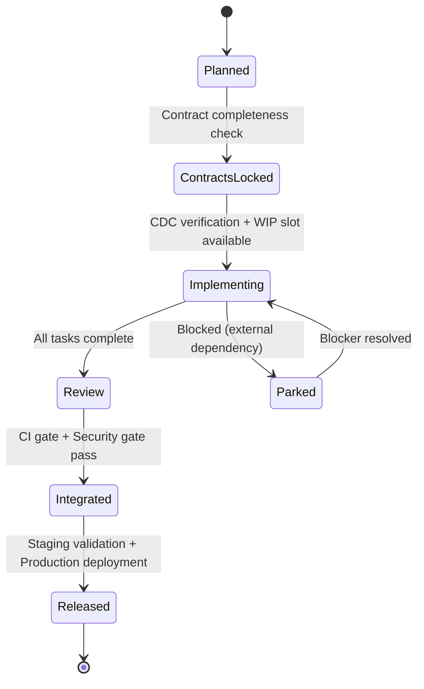

# Epic State Machine

**Version**: 1.0.0
**Purpose**: Define epic lifecycle states, gates, and transitions for parallel development coordination.

## Overview

Epics are the parallelization unit in the Spec-Flow workflow. Each epic represents a vertical slice (API + DB + UI) that can be developed independently after contracts are locked.

**Key Principles**:

- **One WIP epic per agent**: Enforce focus and prevent context switching
- **Contract-first**: Lock API schemas before parallel implementation begins
- **Trunk-based**: Max 24h branch lifetime, daily merges with feature flags
- **Automatic parking**: Blocked epics auto-reassign to unblock agents

## State Machine



## States

### 1. Planned

**Description**: Epic defined in `plan.md`, dependencies identified, ready for contract design.

**Entry Criteria**:

- Epic extracted from `/plan` output
- Vertical slice boundaries clear (API endpoints, DB tables, UI screens)
- Dependencies documented

**Artifacts**:

- `plan.md` section for this epic
- Dependency graph entry

**Allowed Actions**:

- Design contracts (OpenAPI schemas, JSON Schema events)
- Create Pact CDC tests
- Identify shared types/fixtures

**Exit Criteria**:

- Contracts drafted in `contracts/api/vX.Y.Z/`
- CDC pacts created in `contracts/pacts/`
- Breaking changes flagged (major version bump)

**Next State**: `ContractsLocked`

---

### 2. ContractsLocked

**Description**: API schemas locked, CDC tests written, ready for parallel implementation.

**Entry Criteria**:

- Contracts committed and versioned
- CDC pacts pass verification: `/contract.verify`
- Golden fixtures refreshed: `/fixture.refresh`

**Artifacts**:

- Locked OpenAPI spec (e.g., `contracts/api/v1.1.0/openapi.yaml`)
- Passing CDC pacts
- Golden fixtures matching schemas

**Blocking Gate**: **CDC Verification Gate**

- All pacts must pass before implementation starts
- Prevents breaking existing consumers
- Enforced by CI (blocks epic assignment if fails)

**Allowed Actions**:

- Request WIP slot from scheduler: `/scheduler.assign <epic-name>`
- Wait in queue if all slots occupied

**Exit Criteria**:

- WIP slot available (max 1 epic per agent)
- Agent assigned via scheduler

**Next State**: `Implementing`

---

### 3. Implementing

**Description**: Active development with daily merges and feature flag protection.

**Entry Criteria**:

- WIP slot acquired
- Agent assigned
- Contracts locked and verified

**Artifacts**:

- Feature flag registered: `/flag.add <epic_name>_enabled --reason "Epic in progress"`
- Active git branch (max 24h lifetime)
- Task checklist in `tasks.md`

**WIP Enforcement**:

- One epic per agent (tracked in `wip-tracker.yaml`)
- Other epics for this agent stay in `ContractsLocked` or `Parked`
- Automatic parking if blocked >4h

**Allowed Actions**:

- Implement tasks behind feature flag
- Merge to main daily (branch age <24h)
- Request parking if blocked: `/scheduler.park <epic-name> --reason "Waiting for DBA"`

**Exit Criteria**:

- All tasks marked complete
- Code merged to main
- Feature flag still active (feature incomplete from user perspective)

**Next State**: `Review` or `Parked` (if blocked)

---

### 4. Review

**Description**: Code complete, quality gates running, awaiting merge approval.

**Entry Criteria**:

- All tasks complete
- Code on main behind feature flag
- PR created (if applicable)

**Artifacts**:

- `optimization-report.md`
- `code-review-report.md`
- CI test results

**Blocking Gates**:

1. **CI Gate** (`/gate.ci`):

   - Unit tests pass (min 80% coverage)
   - Integration tests pass
   - Linters pass (ESLint, Prettier)
   - Type checks pass (TypeScript)

2. **Security Gate** (`/gate.sec`):
   - SAST scan passes (Semgrep, CodeQL)
   - Dependency audit passes (npm audit, Snyk)
   - No secrets committed (git-secrets)

**Allowed Actions**:

- Fix failing gates
- Manual code review

**Exit Criteria**:

- CI gate passes
- Security gate passes
- Code review approved

**Next State**: `Integrated`

---

### 5. Integrated

**Description**: Code merged to main, feature flag enabled in staging/production.

**Entry Criteria**:

- Quality gates passed
- Code on main branch
- Feature flag toggled ON in staging

**Artifacts**:

- Feature flag still active
- Deployment to staging complete
- Staging validation checklist

**Manual Gate**: **Staging Validation**

- Manual QA in staging environment
- Acceptance criteria verified
- Performance checked

**Allowed Actions**:

- Staging testing
- Toggle feature flag in production (gradual rollout)

**Exit Criteria**:

- Staging validation passed
- Feature flag toggled ON in production
- No P0/P1 issues found

**Next State**: `Released`

---

### 6. Released

**Description**: Feature fully deployed, flag retired, epic complete.

**Entry Criteria**:

- Production deployment complete
- Feature flag enabled for all users
- Monitoring shows healthy metrics

**Artifacts**:

- Feature flag retired: `/flag.cleanup <epic_name>_enabled --verify`
- `production-ship-report.md`
- DORA metrics updated

**Allowed Actions**:

- Monitor production metrics
- Remove feature flag code
- Archive epic documentation

**Exit Criteria**:

- Feature flag code removed
- Epic marked complete in roadmap
- DORA metrics recorded (lead time, deployment frequency)

**Next State**: Terminal (epic complete)

---

### 7. Parked (Special State)

**Description**: Epic blocked by external dependency, WIP slot released for other work.

**Entry Criteria**:

- Agent reports blocker (manual or auto-detected after 4h)
- Blocker type: external API, DBA approval, design decision, dependency on other epic

**Artifacts**:

- Parking reason in `wip-tracker.yaml`
- Notification to blocker owner
- WIP slot released

**Automatic Parking Triggers**:

- No commits for 4 hours during business hours
- Explicit `/scheduler.park` command
- CI repeatedly failing (>3 attempts in 2h)

**Allowed Actions**:

- Wait for blocker resolution
- Work on other epics (WIP slot freed)
- Check blocker status

**Exit Criteria**:

- Blocker resolved (manual confirmation or webhook)
- WIP slot available
- Agent re-assigned via scheduler

**Next State**: `Implementing`

## State Transitions

### Transition Rules

| From              | To                | Trigger                                     | Gate                        |
| ----------------- | ----------------- | ------------------------------------------- | --------------------------- |
| `Planned`         | `ContractsLocked` | Contracts drafted, pacts created            | Contract completeness check |
| `ContractsLocked` | `Implementing`    | `/scheduler.assign` with available WIP slot | CDC verification passes     |
| `Implementing`    | `Review`          | All tasks complete                          | None (automatic)            |
| `Implementing`    | `Parked`          | `/scheduler.park` or auto-parked after 4h   | None                        |
| `Review`          | `Integrated`      | Quality gates pass                          | CI gate + Security gate     |
| `Integrated`      | `Released`        | Production deployment + flag retirement     | Staging validation (manual) |
| `Parked`          | `Implementing`    | Blocker resolved + WIP slot available       | None                        |

### Blocking Conditions

**Cannot progress if**:

- **Planned → ContractsLocked**: Contracts incomplete, pacts missing, no versioning
- **ContractsLocked → Implementing**: CDC verification fails, no WIP slot available
- **Implementing → Review**: Tasks incomplete, branch age >24h without flag
- **Review → Integrated**: CI gate fails, security gate fails, critical code review issues
- **Integrated → Released**: Staging validation failed, P0/P1 issues found

## WIP Enforcement

### WIP Tracker Format

**File**: `.spec-flow/memory/wip-tracker.yaml`

```yaml
agents:
  - name: backend-agent
    current_epic: epic-auth-api
    state: Implementing
    started: 2025-11-10T14:30:00Z

  - name: frontend-agent
    current_epic: epic-auth-ui
    state: Implementing
    started: 2025-11-10T15:00:00Z

parked_epics:
  - name: epic-payment-integration
    reason: "Waiting for Stripe API keys from DevOps"
    parked_at: 2025-11-10T10:00:00Z
    blocked_by: devops-team
    notify_when_resolved: backend-agent
```

### WIP Rules

1. **One epic per agent**: Enforced by `/scheduler.assign`
2. **Queue overflow**: New epics wait in `ContractsLocked` until slot opens
3. **Automatic parking**: Frees slot if no progress >4h
4. **Re-assignment**: Parked epic can be picked up by any agent when unblocked

## Scheduler Commands

### `/scheduler.assign <epic-name>`

**Purpose**: Request WIP slot for an epic in `ContractsLocked` state.

**Behavior**:

1. Check epic state (must be `ContractsLocked`)
2. Check WIP slots (max 1 per agent)
3. If slot available:
   - Assign epic to requesting agent
   - Update `wip-tracker.yaml`
   - Transition epic to `Implementing`
4. If no slot:
   - Queue epic (FIFO)
   - Notify when slot opens

**Example**:

```bash
/scheduler.assign epic-auth-api
# Output:
# ✅ Assigned epic-auth-api to backend-agent
# State: ContractsLocked → Implementing
# WIP Slot: 1/1 occupied
```

### `/scheduler.park <epic-name> --reason <text>`

**Purpose**: Park current epic due to blocker, release WIP slot.

**Behavior**:

1. Verify epic is in `Implementing` state
2. Record parking reason
3. Transition to `Parked`
4. Release WIP slot
5. Notify next epic in queue

**Example**:

```bash
/scheduler.park epic-payment-integration --reason "Waiting for Stripe API keys"
# Output:
# ⚠️ Parked epic-payment-integration
# Reason: Waiting for Stripe API keys
# WIP Slot: Released (0/1 occupied)
# Next in queue: epic-search-api
```

### `/scheduler.list`

**Purpose**: Show all epics with current state and WIP status.

**Example Output**:

```
Epic State Summary
━━━━━━━━━━━━━━━━━━━━━━━━━━━━━━━━━━━━━━━━━

Implementing (2):
  • epic-auth-api (backend-agent) - 3h 15m
  • epic-auth-ui (frontend-agent) - 2h 45m

Contracts Locked (1):
  • epic-search-api (queued)

Parked (1):
  • epic-payment-integration
    Reason: Waiting for Stripe API keys
    Blocked by: devops-team

WIP Status: 2/2 slots occupied
```

## Quality Gates

### CI Gate (`/gate.ci`)

**Runs on**: `Review` state entry

**Checks**:

- Unit tests pass (Jest, Vitest, Pytest)
- Integration tests pass (Playwright, Cypress)
- Code coverage ≥80% (Istanbul, Coverage.py)
- Linters pass (ESLint, Prettier, Black)
- Type checks pass (TypeScript, mypy)

**Pass Criteria**: All checks green

**Failure Handling**:

- Block `Review → Integrated` transition
- Notify agent with failure details
- Allow re-run after fixes

### Security Gate (`/gate.sec`)

**Runs on**: `Review` state entry (parallel with CI gate)

**Checks**:

- SAST scan passes (Semgrep, CodeQL)
- Dependency audit (npm audit, Snyk, pip-audit)
- Secrets detection (git-secrets, truffleHog)
- License compliance (FOSSA, LicenseFinder)

**Pass Criteria**: No HIGH/CRITICAL vulnerabilities

**Failure Handling**:

- Block `Review → Integrated` transition
- Create security issue in GitHub
- Require fix or risk acceptance

### CDC Verification Gate (`/contract.verify`)

**Runs on**: `ContractsLocked` state entry

**Checks**:

- All pacts pass verification
- No breaking changes (or major version bump approved)
- Fixtures match schemas

**Pass Criteria**: All pacts green

**Failure Handling**:

- Block `ContractsLocked → Implementing` transition
- Highlight contract violations
- Require contract fixes before implementation

## Integration with Existing Workflow

### Epic Extraction from `/plan`

When `/plan` generates `plan.md`, include epic breakdowns:

```markdown
## Epic Breakdown

### Epic 1: Authentication API

**Vertical Slice**: Backend + Database
**Contracts**: POST /auth/login, POST /auth/register
**Dependencies**: None
**Estimated Tasks**: 8

### Epic 2: Authentication UI

**Vertical Slice**: Frontend
**Contracts**: Consumes /auth/login, /auth/register
**Dependencies**: Epic 1 (contracts locked)
**Estimated Tasks**: 6
```

The scheduler parses this section to build the dependency graph.

### Integration with `/implement`

**Before parallel mode**:

```bash
/implement
# Implements all tasks sequentially
```

**After parallel mode**:

```bash
/implement --parallel
# 1. Parse plan.md for epic breakdowns
# 2. Lock contracts for all epics: /contract.verify
# 3. Launch specialist agents for each epic
# 4. Scheduler assigns epics to agents (WIP enforced)
# 5. Monitor progress in wip-tracker.yaml
```

### Integration with `/ship`

**Epic-aware shipping**:

- Check if any epics still in `Implementing` or `Review` states
- Block `/ship` if critical epics incomplete
- Allow `/ship` if only nice-to-have epics remain (with warning)

## Monitoring & Observability

### WIP Dashboard

Real-time view of epic progress:

```bash
/scheduler.dashboard
```

**Output**:

```
Epic WIP Dashboard
━━━━━━━━━━━━━━━━━━━━━━━━━━━━━━━━━━━━━━━━━

Sprint: 2025-11-04 to 2025-11-18 (Week 1/2)
Sprint Goal: Implement authentication system

Implementing (2/4 agents busy):
┌─────────────────────────────────────────┐
│ epic-auth-api (backend-agent)           │
│ Progress: 6/8 tasks (75%)               │
│ Time: 3h 15m / 8h estimated             │
│ ETA: Today 18:00                        │
│ Status: ✅ On track                     │
└─────────────────────────────────────────┘

┌─────────────────────────────────────────┐
│ epic-auth-ui (frontend-agent)           │
│ Progress: 3/6 tasks (50%)               │
│ Time: 2h 45m / 6h estimated             │
│ ETA: Tomorrow 12:00                     │
│ Status: ⚠️ Slightly behind              │
└─────────────────────────────────────────┘

Contracts Locked (1):
  • epic-search-api (Waiting for WIP slot)

Parked (1):
  • epic-payment-integration (Blocked: Stripe API keys)

Queued: 2 epics waiting for contracts to lock
```

### DORA Metrics per Epic

Track epic-level metrics for bottleneck detection:

- **Lead Time**: Planned → Released (by epic)
- **Cycle Time**: Implementing → Integrated (active dev time)
- **Parking Time**: Total time in `Parked` state (indicates blockers)
- **Gate Failure Rate**: % of epics failing CI/Security gates

**Alerting**:

- Epic in `Implementing` >24h without progress → Slack alert
- Epic parked >48h → Escalate to unblock
- Gate failure rate >30% → Process issue (tests flaky, security debt)

## State Schema Updates

### `state.yaml` Extensions

Add epic state tracking to existing workflow state:

```yaml
# Existing fields
phase: implement
status: in_progress
current_feature: authentication-system
started: 2025-11-10T14:00:00Z

# New epic fields
epic_mode: true
epics:
  - name: epic-auth-api
    state: Implementing
    agent: backend-agent
    started: 2025-11-10T14:30:00Z
    tasks_complete: 6
    tasks_total: 8
    feature_flag: auth_api_enabled

  - name: epic-auth-ui
    state: ContractsLocked
    contracts_locked_at: 2025-11-10T14:00:00Z
    waiting_for_wip_slot: true

  - name: epic-payment-integration
    state: Parked
    parked_at: 2025-11-10T10:00:00Z
    parked_reason: "Waiting for Stripe API keys"
    blocked_by: devops-team

wip_limits:
  max_per_agent: 1
  current_utilization: 1/2 # 1 of 2 agents busy
```

## Example Workflow

### Sprint Start (Day 1)

```bash
# 1. Plan feature with epic breakdowns
/plan
# Generates plan.md with 3 epics

# 2. Lock contracts for all epics
/contract.verify
# All pacts pass → epics transition to ContractsLocked

# 3. Assign first epic to backend agent
/scheduler.assign epic-auth-api
# WIP slot acquired, state → Implementing

# 4. Assign second epic to frontend agent
/scheduler.assign epic-auth-ui
# WIP slot acquired, state → Implementing
```

### Mid-Sprint (Day 5)

```bash
# Backend agent blocks on DBA approval
/scheduler.park epic-auth-api --reason "Need DBA approval for RLS policies"
# WIP slot released, state → Parked

# Scheduler auto-assigns next epic from queue
# epic-search-api gets assigned to backend-agent
# State: ContractsLocked → Implementing
```

### Sprint End (Day 10)

```bash
# All epics in Review state, gates running
/gate.ci epic-auth-api
/gate.sec epic-auth-api
# Gates pass → state: Review → Integrated

# Staging validation
/ship-staging
# Manual QA passes → ready for production

# Production release
/ship-prod
# State: Integrated → Released

# Cleanup flags
/flag.cleanup auth_api_enabled --verify
/flag.cleanup auth_ui_enabled --verify
```

## References

- **Trunk-Based Development**: https://trunkbaseddevelopment.com/
- **Consumer-Driven Contracts**: https://docs.pact.io/
- **Team Topologies (WIP Limits)**: https://teamtopologies.com/
- **DORA Metrics**: https://dora.dev/
- **Scrum Guide (Definition of Done)**: https://scrumguides.org/

---

**Version History**:

- v1.0.0 (2025-11-10): Initial state machine definition with 5 states + parking logic
