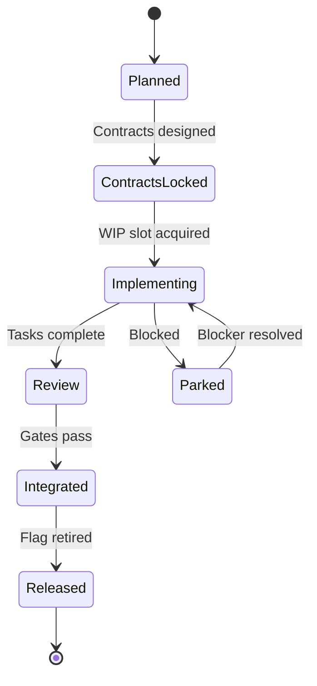
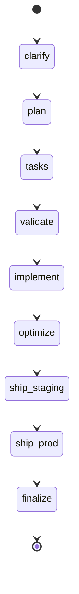

# Workflow State Schema

**Version**: 2.1.0 (Workflow Type Detection)
**File**: `.spec-flow/memory/state.yaml`

## Overview

The workflow state file tracks the current phase, progress, and epic-level coordination for feature development. It serves as the single source of truth for workflow progression.

**Version History**:

- v1.0.0: Basic feature tracking (phase, status, artifacts)
- v2.0.0: Epic mode extensions (parallel development, WIP tracking)
- v2.1.0: Explicit workflow type and base directory tracking

## Schema Definition

### Root Fields

```yaml
# Feature-level tracking (v1.0.0)
phase: string # Current workflow phase
status: string # Phase status (in_progress, completed, failed)
current_feature: string # Feature name or ID
started: ISO8601 # When feature work started
last_updated: ISO8601 # Last modification timestamp

# Workflow type detection (v2.1.0)
workflow_type: string # Workflow type: "epic" or "feature"
base_directory: string # Workspace directory: "epics" or "specs"

# Epic mode extensions (v2.0.0)
epic_mode: boolean # True if feature uses epic parallelization
epics: array # List of epic objects (see below)
wip_limits: object # WIP enforcement configuration
```

### Epic Object

```yaml
epics:
  - name: string # Epic identifier (e.g., "epic-auth-api")
    state: string # Epic state (see state machine)
    agent: string # Assigned agent name
    started: ISO8601 # When implementation started
    contracts_locked_at: ISO8601 # When contracts were locked
    parked_at: ISO8601 # When epic was parked (if Parked state)
    parked_reason: string # Why epic was parked
    blocked_by: string # Who/what is blocking
    tasks_complete: number # Tasks completed
    tasks_total: number # Total tasks for epic
    feature_flag: string # Associated feature flag name
    waiting_for_wip_slot: boolean # True if queued for WIP slot
```

### Epic States

| State             | Description                                     |
| ----------------- | ----------------------------------------------- |
| `Planned`         | Epic defined in plan.md, contracts not designed |
| `ContractsLocked` | API schemas locked, ready for implementation    |
| `Implementing`    | Active development with agent assigned          |
| `Parked`          | Blocked by external dependency                  |
| `Review`          | Code complete, quality gates running            |
| `Integrated`      | Merged to main, feature flag enabled            |
| `Released`        | Feature flag retired, fully deployed            |

### WIP Limits Object

```yaml
wip_limits:
  max_per_agent: number # Max epics per agent (default: 1)
  current_utilization: string # Format: "N/M" (N occupied of M total)
```

### Deployment Object

Tracks deployment status, version information, and finalization progress.

```yaml
deployment:
  model: string # Deployment model: staging-prod | direct-prod | local-only
  version: string # Semantic version (e.g., "1.2.3" without 'v' prefix)

  staging:
    url: string # Staging deployment URL
    deployed_at: ISO8601 # Staging deployment timestamp
    deployment_id: string # Platform-specific deployment ID (Vercel/Railway/etc)
    validated: boolean # True if /validate-staging passed
    validated_at: ISO8601 # Staging validation timestamp

  production:
    url: string # Production deployment URL
    deployed_at: ISO8601 # Production deployment timestamp
    deployment_id: string # Platform-specific deployment ID
    tag: string # Git tag used for deployment (e.g., "v1.2.3")
    tag_created_at: ISO8601 # Tag creation timestamp
    github_release_url: string # GitHub release URL for this version

  finalization:
    essential_complete: boolean # True if roadmap updated + branch cleaned
    essential_completed_at: ISO8601 # Essential finalization timestamp
    full_complete: boolean # True if CHANGELOG, README, docs updated
    full_completed_at: ISO8601 # Full finalization timestamp
    changelog_updated: boolean # CHANGELOG.md versioned
    readme_updated: boolean # README.md updated
    help_docs_updated: boolean # User documentation updated
    milestone_closed: boolean # GitHub milestone closed
    release_created: boolean # GitHub release created
```

**Deployment Model Detection**:

- **staging-prod**: Git remote + staging branch + `.github/workflows/deploy-staging.yml`
- **direct-prod**: Git remote + no staging branch/workflow
- **local-only**: No git remote configured

**Tagged Promotion** (staging-prod model):

- Version extracted from CHANGELOG.md
- User selects patch/minor/major bump
- Git tag created: `v{version}`
- Tag pushed to trigger `.github/workflows/deploy-production.yml`
- GitHub Actions deploys to production
- GitHub Release created with changelog excerpt

**Finalization Phases**:

1. **Essential** (automatic via `/ship`):
   - Update roadmap issue to 'shipped'
   - Clean up feature branch (local + remote)
   - Check for infrastructure cleanup needs
2. **Full** (automatic via `/ship` → `/finalize`):
   - Update CHANGELOG.md with versioned release
   - Update README.md with new features
   - Update help documentation
   - Close GitHub milestone
   - Create GitHub release (if tagged promotion)

## Example: Single Feature (v2.1.0)

```yaml
phase: implement
status: in_progress
current_feature: user-authentication
started: 2025-11-10T14:00:00Z
last_updated: 2025-11-10T16:30:00Z

# Workflow type (v2.1.0)
workflow_type: feature
base_directory: specs

completed_phases:
  - clarify
  - plan
  - tasks
  - validate
artifacts:
  spec: specs/001-user-auth/spec.md
  plan: specs/001-user-auth/plan.md
  tasks: specs/001-user-auth/tasks.md
```

## Example: Epic Mode (v2.1.0)

```yaml
phase: implement
status: in_progress
current_feature: authentication-system
started: 2025-11-10T14:00:00Z
last_updated: 2025-11-10T18:45:00Z

# Workflow type (v2.1.0)
workflow_type: epic
base_directory: epics

# Epic mode enabled (v2.0.0)
epic_mode: true

epics:
  # Epic 1: Backend API (Implementing)
  - name: epic-auth-api
    state: Implementing
    agent: backend-agent
    started: 2025-11-10T14:30:00Z
    contracts_locked_at: 2025-11-10T14:00:00Z
    tasks_complete: 6
    tasks_total: 8
    feature_flag: auth_api_enabled

  # Epic 2: Frontend UI (Implementing)
  - name: epic-auth-ui
    state: Implementing
    agent: frontend-agent
    started: 2025-11-10T15:00:00Z
    contracts_locked_at: 2025-11-10T14:00:00Z
    tasks_complete: 3
    tasks_total: 6
    feature_flag: auth_ui_enabled

  # Epic 3: Search API (Queued)
  - name: epic-search-api
    state: ContractsLocked
    contracts_locked_at: 2025-11-10T16:00:00Z
    waiting_for_wip_slot: true

  # Epic 4: Payment Integration (Parked)
  - name: epic-payment-integration
    state: Parked
    parked_at: 2025-11-10T10:00:00Z
    parked_reason: "Waiting for Stripe API keys from DevOps"
    blocked_by: devops-team
    feature_flag: payment_integration_enabled

wip_limits:
  max_per_agent: 1
  current_utilization: "2/2" # 2 agents, both occupied

completed_phases:
  - clarify
  - plan
  - tasks
  - validate

artifacts:
  spec: specs/002-auth-system/spec.md
  plan: specs/002-auth-system/plan.md
  tasks: specs/002-auth-system/tasks.md
  contracts: contracts/api/v1.1.0/openapi.yaml
```

## Field Validation Rules

### Required Fields (All Features)

```yaml
phase: <one of: clarify, plan, tasks, validate, implement, optimize, ship-staging, ship-prod, finalize>
status: <one of: in_progress, completed, failed, paused>
current_feature: <non-empty string>
started: <ISO 8601 timestamp>
workflow_type: <one of: epic, feature>  # v2.1.0+
base_directory: <one of: epics, specs>  # v2.1.0+
```

### Required Fields (Epic Mode)

When `epic_mode: true`:

```yaml
epics: <non-empty array>
epics[].name: <non-empty string>
epics[].state: <one of: Planned, ContractsLocked, Implementing, Parked, Review, Integrated, Released>
wip_limits.max_per_agent: <positive integer>
```

### Conditional Fields

**When epic state = Implementing**:

- `agent` (required)
- `started` (required)
- `feature_flag` (required)

**When epic state = Parked**:

- `parked_at` (required)
- `parked_reason` (required)

**When epic state = ContractsLocked**:

- `contracts_locked_at` (required)

### Manual Gates (Optional)

Manual gates pause workflow progression until user approval is granted.

**Location**: Root level field `manual_gates`

**Structure**:

```yaml
manual_gates:
  mockup_approval:
    status: "pending" # pending | approved | rejected | not_applicable
    mockup_path: "specs/NNN-slug/mockups/screen-name.html"
    tokens_css_linked: true
    approved_at: null
    approved_by: null
    requested_changes: null
    style_guide_updates: null
  staging_validation:
    status: "pending" # pending | approved | failed | not_applicable
    staging_url: null
    validated_at: null
    validated_by: null
    rollback_tested: false
```

**Gate Definitions**:

**mockup_approval** (UI-first features only):

- **Trigger**: After `/tasks --ui-first` creates HTML mockups
- **Blocks**: `/implement` execution until status = "approved"
- **Required Fields**: `mockup_path`, `tokens_css_linked`
- **Optional Fields**: `requested_changes` (user feedback), `style_guide_updates` (proposed tokens.css changes)
- **Approval Flow**:
  1. User opens HTML mockup in browser
  2. User reviews against mockup-approval-checklist.md
  3. User updates `status: "approved"` in state.yaml
  4. User runs `/feature continue` to proceed

**staging_validation** (staging-prod model only):

- **Trigger**: After `/ship-staging` deploys to staging
- **Blocks**: `/ship-prod` execution until status = "approved"
- **Purpose**: Manual testing in staging environment
- **Approval Flow**:
  1. User tests feature in staging
  2. Rollback test executed automatically
  3. User updates `status: "approved"` in state.yaml
  4. User runs `/ship continue` to proceed

**Example (UI-first feature)**:

```yaml
version: 2.1.0
phase: implement
status: in_progress
current_feature: 001-user-dashboard
started: 2025-11-14T10:00:00Z
workflow_type: feature
base_directory: specs
manual_gates:
  mockup_approval:
    status: approved
    mockup_path: specs/001-user-dashboard/mockups/dashboard.html
    tokens_css_linked: true
    approved_at: 2025-11-14T11:30:00Z
    approved_by: Marcus Gollahon
    requested_changes: "Increase spacing between cards"
    style_guide_updates:
      - file: design/systems/tokens.css
        token: --space-card-gap
        from: var(--space-4)
        to: var(--space-6)
  staging_validation:
    status: not_applicable
```

**Example (non-UI feature)**:

```yaml
version: 2.1.0
phase: implement
status: in_progress
current_feature: 002-api-caching
started: 2025-11-14T12:00:00Z
workflow_type: feature
base_directory: specs
manual_gates:
  mockup_approval:
    status: not_applicable
  staging_validation:
    status: not_applicable
```

## State Transitions

### Epic State Machine



### Feature Phase Progression



## Schema Migrations

### Migrating from v1.0.0 to v2.0.0

**When to migrate**: When enabling epic parallelization for a feature.

**Steps**:

1. Add `epic_mode: true`
2. Create `epics` array from task breakdown
3. Initialize `wip_limits`
4. Lock contracts before assigning epics

**Example**:

```bash
# Before (v1.0.0)
yq eval '.phase = "implement"' -i state.yaml

# After (v2.0.0)
yq eval '.epic_mode = true' -i state.yaml
yq eval '.epics = []' -i state.yaml
yq eval '.wip_limits.max_per_agent = 1' -i state.yaml

# Add first epic
yq eval '.epics += [{
  "name": "epic-auth-api",
  "state": "ContractsLocked",
  "contracts_locked_at": "2025-11-10T14:00:00Z"
}]' -i state.yaml
```

### Backward Compatibility

**v2.0.0 is backward compatible with v1.0.0**:

- Non-epic features continue to work (ignore `epics`, `wip_limits`)
- Epic mode is opt-in via `epic_mode: true`

## Usage in Commands

### `/scheduler.assign`

**Reads**:

- `epics[].state` - Check if epic in `ContractsLocked`
- `epics[].name` - Find target epic

**Writes**:

- `epics[].state` - Update to `Implementing`
- `epics[].agent` - Assign agent name
- `epics[].started` - Record start timestamp
- `wip_limits.current_utilization` - Update slot count

### `/scheduler.park`

**Reads**:

- `epics[].state` - Check if epic in `Implementing`
- `epics[].agent` - Find agent to release

**Writes**:

- `epics[].state` - Update to `Parked`
- `epics[].parked_at` - Record parking timestamp
- `epics[].parked_reason` - Store reason
- `epics[].blocked_by` - Store blocker entity
- `wip_limits.current_utilization` - Update slot count

### `/scheduler.list`

**Reads**:

- `epics[]` - All epic objects
- `epics[].state` - Group by state
- `epics[].tasks_complete` / `tasks_total` - Calculate progress
- `wip_limits` - Show slot utilization

### `/implement --parallel`

**Reads**:

- `epic_mode` - Check if parallel mode enabled
- `epics[]` - Get all epics to implement

**Writes**:

- `epics[].state` - Update as implementation progresses
- `epics[].tasks_complete` - Increment on task completion

## Monitoring & Observability

### Health Checks

```bash
# Check for stale epics (Implementing >24h)
yq eval '.epics[] | select(.state == "Implementing") | select(.started < "2025-11-09T00:00:00Z")' state.yaml

# Check for long-parked epics (>48h)
yq eval '.epics[] | select(.state == "Parked") | select(.parked_at < "2025-11-08T00:00:00Z")' state.yaml

# Check WIP slot utilization
yq eval '.wip_limits.current_utilization' state.yaml
```

### Metrics

**Epic-level metrics** (for DORA tracking):

- Lead time per epic: `started` → `Released`
- Cycle time per epic: `Implementing` → `Integrated`
- Parking time: Total time in `Parked` state
- Review time: Time in `Review` state

**Feature-level metrics**:

- Total feature lead time: `started` → `finalize`
- Epic coordination overhead: Sum of parking/queuing times

## Schema Versioning

**Version Format**: `MAJOR.MINOR.PATCH`

**Version Rules**:

- **MAJOR**: Breaking changes (require migration)
- **MINOR**: Additive changes (backward compatible)
- **PATCH**: Bug fixes, clarifications

**Current Version**: 2.1.0

- **2.1.0** (2025-11-20): Explicit workflow type and base directory tracking
- **2.0.0** (2025-11-10): Epic mode extensions
- **1.0.0** (2024-01-01): Initial schema

## References

- Epic State Machine: `.spec-flow/memory/epic-states.md`
- WIP Tracker Schema: `.spec-flow/memory/wip-tracker.yaml`
- Workflow Commands: `.claude/commands/`

---

**Maintained by**: Spec-Flow Workflow Kit
**Last Updated**: 2025-11-20
