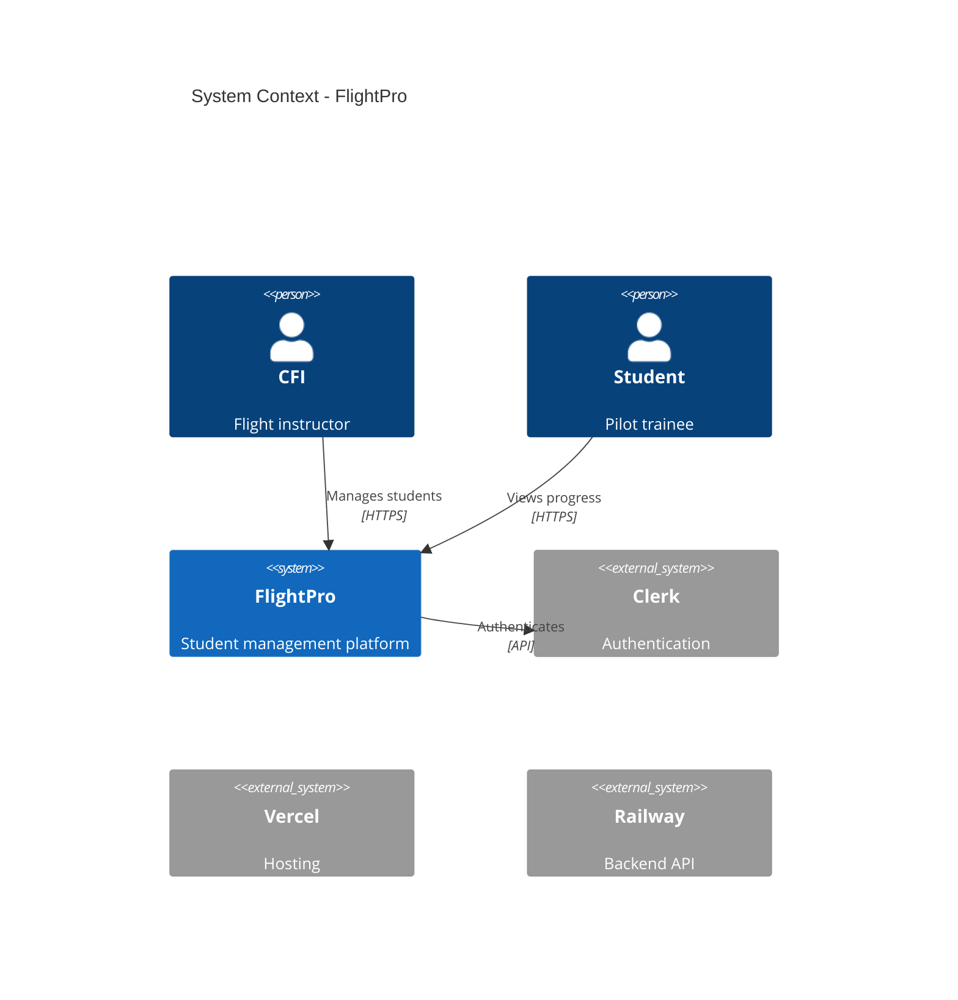
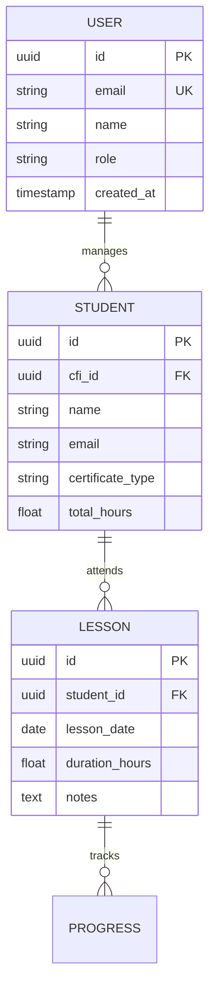

# Project Design Guide

**Last Updated**: 2025-10-24
**Version**: 1.0

## Table of Contents

- [Why Project Design?](#why-project-design)
- [When to Use /init-project](#when-to-use-init-project)
- [Quick Start](#quick-start)
- [The 8 Project Documents](#the-8-project-documents)
- [Greenfield vs Brownfield](#greenfield-vs-brownfield)
- [Interactive Setup](#interactive-setup)
- [What Gets Generated](#what-gets-generated)
- [Workflow Integration](#workflow-integration)
- [Maintaining Project Docs](#maintaining-project-docs)
- [Common Questions](#common-questions)
- [Examples](#examples)

---

## Why Project Design?

### The 80/20 Rule

> "Planning is 80% of the project, 20% code. The more concrete and clear the plan is, the easier it is for Claude Code to stay on the guardrails." — Project Philosophy

### Problems Without Project Design

**Without project-level documentation**, each feature spec/plan involves:

- **Hallucinated tech stack** — Claude might suggest MongoDB when you use PostgreSQL
- **Inconsistent APIs** — One feature uses REST, another uses GraphQL
- **Duplicated entities** — Creating a new User table when one already exists
- **Architectural drift** — Adding microservice patterns to a monolith project
- **Reinventing wheels** — Not knowing what components/services already exist

**Result**: Slower development, technical debt, inconsistent codebase.

### Benefits With Project Design

**With `/init-project` documentation**, Claude Code:

- ✅ **Knows your tech stack** — Reads from `tech-stack.md`, never suggests wrong frameworks
- ✅ **Follows established patterns** — Reads `api-strategy.md`, maintains consistency
- ✅ **Reuses existing entities** — Reads `data-architecture.md`, sees ERD
- ✅ **Respects architecture** — Reads `system-architecture.md`, identifies integration points
- ✅ **Aligns with vision** — Reads `overview.md`, validates features against project scope

**Result**: 20-30% faster feature development, consistent codebase, fewer bugs.

---

## When to Use /init-project

### ✅ Recommended For

**1. New Projects (Greenfield)**

- Starting a new SaaS, web app, API, or product
- Have a vision but need to document architecture
- Want to avoid architectural drift from day one

**2. Existing Projects (Brownfield)**

- Legacy codebase lacking documentation
- Want Claude Code to understand existing architecture
- Planning major refactor or team expansion
- Onboarding new developers (human or AI)

**3. Growing Projects**

- Scaling from solo dev to team
- Evolving from MVP to production
- Adding new major features regularly

### ❌ Skip If

**1. Exploratory Prototypes**

- Quick proof-of-concept (< 1 week)
- Throwaway code
- Experimenting with new tech

**2. Single-Script Projects**

- One-off scripts or utilities
- No long-term maintenance planned

**3. Well-Documented Projects**

- Already have comprehensive architecture docs
- Existing design system and standards
- Established team conventions

---

## Quick Start

### 1. Prerequisites

Ensure you have Spec-Flow installed:

```bash
# Check if /init-project command exists
ls .claude/commands/init-project.md
```

### 2. Run /init-project

In Claude Code:

```bash
/init-project
```

### 3. Answer 15 Questions (~10 minutes)

The interactive setup will ask:

- Project name, vision, target users
- Scale (micro/small/medium/large)
- Tech stack (database, frontend, backend, deployment)
- Architecture style (monolith/microservices/serverless)
- Team size, budget, privacy requirements

### 4. Review Generated Docs

Claude Code generates 8 files in `docs/project/`:

```bash
docs/project/
├── overview.md
├── system-architecture.md
├── tech-stack.md
├── data-architecture.md
├── api-strategy.md
├── capacity-planning.md
├── deployment-strategy.md
└── development-workflow.md
```

### 5. Fill Clarifications

Search for `[NEEDS CLARIFICATION]` markers and fill in details:

```bash
grep -r "NEEDS CLARIFICATION" docs/project/
```

### 6. Commit

```bash
git add docs/project/
git commit -m "docs: add project design documentation"
```

### 7. Start Building

Now run `/roadmap` or `/feature` — all commands will reference project docs.

---

## The 8 Project Documents

### 1. overview.md — Vision & Users

**Purpose**: Single source of truth for "what we're building and why"

**Contents**:

- Vision statement (1 paragraph)
- Target user personas (primary, secondary)
- Core value proposition
- Success metrics (KPIs: revenue, users, engagement)
- Scope boundaries (what's in/out of scope)
- Competitive landscape
- Timeline & milestones

**Used by**:

- `/roadmap` — Validates features against vision and scope
- `/spec` — Ensures features align with target users
- `/plan` — References success metrics for feature prioritization

**Example**:

```markdown
## Vision Statement

FlightPro is a SaaS platform that helps certified flight instructors (CFIs)
manage their students, track progress, and maintain compliance with FAA
regulations. We exist because current solutions are either too expensive
($200+/mo) or lack critical features like ACS-mapped progress tracking.
```

---

### 2. system-architecture.md — Components & Diagrams

**Purpose**: High-level system design with visual diagrams

**Contents**:

- C4 Context Diagram (system boundary, external systems)
- C4 Container Diagram (apps, services, databases)
- Component Architecture (modules, layers)
- Data Flow Diagrams (how data moves through system)
- Security Architecture (auth, encryption, zones)
- Infrastructure Diagram (servers, CDN, storage)

**Used by**:

- `/spec` — Identifies integration points for new features
- `/plan` — Understands where new components fit
- `/implement` — Knows which services to call

**Example** (Mermaid C4 diagram):



---

### 3. tech-stack.md — Technology Choices

**Purpose**: Every framework, library, and tool with rationale

**Contents**:

- Stack overview table (layer, technology, version, purpose)
- Frontend: Framework, state management, routing, styling
- Backend: Framework, API, auth, queues
- Database: Type, ORM, migration tool
- Deployment: Platform, CI/CD, monitoring
- Alternatives rejected (why we didn't choose X)
- Dependency management strategy

**Used by**:

- `/spec` — **Critical** — Avoids suggesting wrong tech
- `/plan` — Uses correct frameworks, versions
- `/implement` — Knows what libraries are available

**Example**:

```markdown
| Layer | Technology | Version | Purpose |
|-------|-----------|---------|---------|
| Frontend | Next.js | 14.2.x | Server-rendered React UI |
| Backend | FastAPI | 0.110.x | Python async API |
| Database | PostgreSQL | 15.x | Relational data storage |
| ORM | SQLAlchemy | 2.0.x | Database abstraction |
| Migrations | Alembic | 1.13.x | Schema versioning |
| Auth | Clerk | Latest | User authentication |
| Deployment | Vercel (FE), Railway (BE) | - | Hosting platforms |

**Alternatives Rejected**:
- **Django** (too heavyweight, prefer FastAPI's async)
- **MongoDB** (need relational data for student records)
- **Auth0** (Clerk has better DX and pricing)
```

---

### 4. data-architecture.md — ERD & Schemas

**Purpose**: All database entities, relationships, and migrations

**Contents**:

- High-level domain model (Mermaid ERD)
- Entity schemas (fields, types, constraints, indexes)
- Relationships (foreign keys, joins)
- Storage strategy (database vs cache vs object storage)
- Data lifecycle (creation, updates, archival, deletion)
- Migration strategy (tools, process, rollback)
- Privacy & compliance (PII, GDPR, retention)

**Used by**:

- `/spec` — Reuses existing entities, avoids duplication
- `/plan` — Designs data models that fit existing schema
- `/implement` — Creates migrations that align with strategy

**Example** (Mermaid ERD):



---

### 5. api-strategy.md — REST/GraphQL Patterns

**Purpose**: All API design standards and patterns

**Contents**:

- API style (REST, GraphQL, tRPC, gRPC)
- Versioning strategy (/api/v1/, header-based, etc.)
- Authentication (JWT, OAuth, API keys)
- Authorization (RBAC, ABAC, scopes)
- Request/response format (JSON, pagination, sorting)
- Error handling (RFC 7807 Problem Details)
- Rate limiting (strategy, limits, quotas)
- Webhooks (if applicable)
- CORS configuration

**Used by**:

- `/spec` — Follows established REST/GraphQL patterns
- `/plan` — Designs endpoints that match existing style
- `/implement` — Uses correct auth, error format, versioning

**Example**:

```markdown
## API Style
**Primary**: REST (JSON)
**Versioning**: URL-based (`/api/v1/`, `/api/v2/`)

## Authentication
**Provider**: Clerk
**Method**: JWT tokens in `Authorization: Bearer <token>` header
**Public endpoints**: `/api/v1/health`, `/api/v1/docs`

## Error Format (RFC 7807)
```json
{
  "type": "https://flightpro.app/errors/validation",
  "title": "Validation Error",
  "status": 422,
  "detail": "Student email must be unique",
  "instance": "/api/v1/students",
  "errors": [
    {
      "field": "email",
      "message": "Email already exists"
    }
  ]
}
```

---

### 6. capacity-planning.md — Scaling Tiers

**Purpose**: Plan for growth from 100 users to 1,000,000

**Contents**:

- Current scale baseline (users, requests, data size)
- Growth projections (10x, 100x, 1000x)
- Resource estimates per tier (CPU, memory, storage, DB)
- Cost model per tier (infrastructure + services)
- Performance targets (response time, throughput, uptime)
- Scaling triggers (when to scale up)
- Bottlenecks & mitigation strategies

**Used by**:

- `/spec` — Designs features for current scale tier
- `/plan` — Plans caching, pagination for performance targets
- `/optimize` — Benchmarks against documented targets

**Example**:

```markdown
## Current Scale (Tier 0: Micro)
- **Users**: 100 active CFIs, 500 students
- **Requests**: ~10K API requests/day
- **Data**: ~5GB database, ~10GB files
- **Cost**: $40/mo (Vercel Hobby + Railway Starter)

## Next Scale (Tier 1: Small)
- **Users**: 1,000 CFIs, 5,000 students (10x)
- **Requests**: ~100K API requests/day (10x)
- **Data**: ~50GB database, ~100GB files (10x)
- **Cost**: $95/mo (Vercel Pro + Railway Developer)
- **Changes needed**: Add Redis cache, database connection pooling
- **Trigger**: When monthly active CFIs > 800
```

---

### 7. deployment-strategy.md — CI/CD & Environments

**Purpose**: How we deploy, test, and rollback

**Contents**:

- Deployment model (staging-prod, direct-prod, local-only)
- Environments (dev, staging, production)
- CI/CD pipeline (GitHub Actions, GitLab CI, etc.)
- Deployment process (steps, approvals, gates)
- Database migrations (how, when, rollback)
- Feature flags (tool, strategy)
- Secrets management (vault, env vars)
- Rollback procedure (how to revert deployment)

**Used by**:

- `/plan` — Plans migrations aligned with deployment process
- `/ship` — Uses correct deployment model
- `/optimize` — Ensures CI/CD pipeline works

**Example**:

```markdown
## Deployment Model
**Type**: staging-prod (two-stage deployment)

**Environments**:
1. **Dev** (local): Developer machines, hot reload
2. **Staging** (staging.flightpro.app): Pre-production testing
3. **Production** (flightpro.app): Live users

## CI/CD Pipeline (GitHub Actions)
**Triggers**: Push to `staging` or `main` branch

**Staging Deploy** (auto):
1. Lint + type check
2. Run unit tests
3. Build Docker images
4. Deploy to Railway staging
5. Run E2E tests
6. **Gate**: Manual approval required

**Production Deploy** (manual gate):
1. Create release PR: `staging` → `main`
2. Code review + approval
3. **Merge triggers**: Deploy to production
4. Run smoke tests
5. Monitor error rate (5 min)
6. Rollback if errors > 1%
```

---

### 8. development-workflow.md — Team Process

**Purpose**: How the team works together (git, PRs, testing)

**Contents**:

- Team structure (roles, responsibilities)
- Git workflow (GitHub Flow, Git Flow, Trunk-Based)
- Branch naming conventions
- Pull request process (template, reviews, checks)
- Commit conventions (Conventional Commits)
- Code style guidelines (linters, formatters)
- Testing strategy (unit, integration, E2E, coverage targets)
- Definition of Done (checklist)
- Issue tracking (tool, labels, board)
- Release process (versioning, changelog, cadence)

**Used by**:

- `/implement` — Follows testing strategy, code style
- `/ship` — Uses correct git workflow, PR process
- Developers — Onboarding guide

**Example**:

```markdown
## Git Workflow
**Strategy**: GitHub Flow (simplified)

**Branches**:
- `main` — Production code (always deployable)
- `staging` — Staging environment (pre-production)
- `feature/[name]` — Feature branches (short-lived)

## Testing Strategy
**Coverage Target**: 80% line coverage

**Test Pyramid**:
- **Unit tests (60%)**: Business logic, utilities, pure functions
  - Tool: Jest (frontend), pytest (backend)
  - Run: On every commit
- **Integration tests (30%)**: API endpoints, database interactions
  - Tool: pytest with TestClient
  - Run: On PR creation
- **E2E tests (10%)**: Critical user flows (login, create student)
  - Tool: Playwright
  - Run: Before deployment

## Definition of Done
- [ ] Feature implemented per spec
- [ ] Unit tests added (80% coverage)
- [ ] Integration tests added (if API changes)
- [ ] E2E test added (if critical flow)
- [ ] Linter passes (no warnings)
- [ ] Type checker passes (no errors)
- [ ] Code reviewed (1 approval)
- [ ] Tested in staging
```

---

## Greenfield vs Brownfield

### Greenfield (New Project)

**What happens**:

1. You answer 15 questions (~10 min)
2. Claude generates 8 docs from templates
3. Many `[NEEDS CLARIFICATION]` sections (you fill later)
4. Reasonable defaults applied (e.g., monolith for solo dev)

**Example output**:

```markdown
# tech-stack.md (greenfield)

| Layer | Technology | Version | Purpose |
|-------|-----------|---------|---------|
| Frontend | Next.js | 14.x | [User answered Q15: Next.js] |
| Backend | [NEEDS CLARIFICATION] | - | [Not specified in setup] |
| Database | PostgreSQL | 15.x | [User answered Q7: PostgreSQL] |
```

**Time to complete**: ~20 minutes (10 min setup + 10 min review/fill clarifications)

---

### Brownfield (Existing Codebase)

**What happens**:

1. You answer 15 questions (~10 min)
2. **Claude scans your codebase** (auto-detect tech stack)
3. Fewer `[NEEDS CLARIFICATION]` (more inferred from code)
4. Generates 8 docs with accurate existing patterns

**Codebase scan** (automatic):

- Reads `package.json` → detects Node.js, React, Next.js, TypeScript
- Reads `requirements.txt` → detects Python, FastAPI, Django
- Reads `go.mod`, `Cargo.toml`, `Gemfile` → detects Go, Rust, Ruby
- Scans migrations → generates ERD from existing schema
- Scans routes → detects API patterns (REST, GraphQL)

**Example output**:

```markdown
# tech-stack.md (brownfield)

**Detected from codebase**: package.json, requirements.txt, alembic/versions/

| Layer | Technology | Version | Purpose |
|-------|-----------|---------|---------|
| Frontend | Next.js | 14.2.3 | [Detected from package.json] |
| Backend | FastAPI | 0.110.0 | [Detected from requirements.txt] |
| Database | PostgreSQL | 15.x | [Detected from alembic migrations] |
| ORM | SQLAlchemy | 2.0.27 | [Detected from requirements.txt] |
```

**Time to complete**: ~15 minutes (10 min setup + 5 min review — less clarification needed)

**Benefits**:

- 20-30% fewer `[NEEDS CLARIFICATION]` sections
- Accurate ERD generated from migrations
- Correct API patterns detected from existing routes
- Realistic examples based on actual codebase

---

## Interactive Setup

### The 15 Questions

**Q1-Q3: Project Basics**

1. **Project name** (e.g., "FlightPro")
2. **Vision** (1 sentence: what problem are you solving?)
3. **Primary users** (who is this for? e.g., "CFIs")

**Q4-Q6: Scale & Team**
4. **Scale tier** (micro: 100 users | small: 1K | medium: 10K | large: 100K+)
5. **Team size** (solo | small: 2-5 | medium: 6-20 | large: 20+)
6. **Architecture style** (monolith | microservices | serverless)

**Q7-Q10: Tech Stack**
7. **Database** (PostgreSQL | MySQL | MongoDB | SQLite | etc.)
8. **Deployment platform** (Vercel | Railway | AWS | GCP | Azure | Heroku | etc.)
9. **API style** (REST | GraphQL | tRPC | gRPC)
10. **Auth provider** (Clerk | Auth0 | Supabase Auth | custom | none)

**Q11-Q13: Constraints**
11. **Budget** (monthly MVP cost in USD, e.g., "$50")
12. **Privacy requirements** (public | PII | GDPR | HIPAA | SOC2)
13. **Git workflow** (GitHub Flow | Git Flow | Trunk-Based Development)

**Q14-Q15: Frontend & Deployment**
14. **Deployment model** (staging-prod | direct-prod | local-only)
15. **Frontend framework** (Next.js | React | Vue | Svelte | Angular | none)

**Time**: ~10 minutes

---

## What Gets Generated

### File Structure

After `/init-project`:

```
docs/
└── project/
    ├── overview.md (Vision, users, scope)
    ├── system-architecture.md (C4 diagrams, components)
    ├── tech-stack.md (Languages, frameworks, rationale)
    ├── data-architecture.md (ERD, schemas, migrations)
    ├── api-strategy.md (REST patterns, auth, versioning)
    ├── capacity-planning.md (Micro → scale tiers)
    ├── deployment-strategy.md (CI/CD, environments)
    └── development-workflow.md (Git flow, PR process)
```

### Coverage Estimate

**Greenfield** (minimal info):

- Filled from questionnaire: 70%
- Inferred from common patterns: 10%
- Needs clarification: 20%

**Brownfield** (rich codebase scan):

- Filled from questionnaire: 50%
- Inferred from codebase: 30%
- Needs clarification: 20%

### Clarification Markers

Search for `[NEEDS CLARIFICATION]`:

```bash
grep -r "NEEDS CLARIFICATION" docs/project/
```

**Example**:

```markdown
# overview.md
## Competitors
[NEEDS CLARIFICATION: Who are your main competitors? What do they lack?]

# capacity-planning.md
## Performance Targets
- API response time: [NEEDS CLARIFICATION: p95 < 500ms? 1s?]
```

**Action**: Fill these in manually, then commit.

---

## Workflow Integration

### How Commands Use Project Docs

**Before /init-project**:

```bash
/spec "Add user authentication"
# Claude: "Should we use JWT? OAuth? Auth0? Clerk? Supabase Auth?"
# (Hallucination risk — suggests random tech)
```

**After /init-project**:

```bash
/spec "Add user authentication"
# Claude reads: docs/project/api-strategy.md → Auth: Clerk
# Claude reads: docs/project/tech-stack.md → Frontend: Next.js + Clerk SDK
# Claude: "Using Clerk (per api-strategy.md), adding middleware to Next.js app"
# (No hallucination — follows documented architecture)
```

### Command-by-Command Integration

**`/roadmap`**:

```bash
/roadmap add "Dark mode toggle"

# Reads: docs/project/overview.md
# Checks: Does "dark mode" align with project vision?
# If out of scope → warns user
```

**`/spec "Add student progress dashboard"`**:

```bash
# Phase 0: Research
# Reads:
# - docs/project/tech-stack.md → Frontend: Next.js
# - docs/project/api-strategy.md → API: REST with /api/v1/
# - docs/project/data-architecture.md → Entities: Student, Lesson, Progress
# - docs/project/system-architecture.md → Integration: CFI dashboard component

# Result: Spec uses correct tech, reuses existing entities
```

**`/plan`**:

```bash
# Phase 0: Research & Discovery
# Reads ALL 8 docs from docs/project/
# Generates: research.md with "Project Documentation Context" section

# Example research.md output:
## Project Documentation Context
**Tech Stack** (from tech-stack.md):
- Frontend: Next.js 14.2.x
- Backend: FastAPI 0.110.x
- Database: PostgreSQL 15.x

**Data Architecture** (from data-architecture.md):
- Existing entities: User, Student, Lesson, Progress
- Relationships: User → Student (1:many), Student → Lesson (1:many)

**API Strategy** (from api-strategy.md):
- API style: REST
- Auth: Clerk JWT
- Versioning: /api/v1/
```

---

## Maintaining Project Docs

### When to Update

**Rarely** — Project docs are stable, change infrequently.

**Update when**:

1. **Major tech stack change**
   - Example: Migrating PostgreSQL → MongoDB
   - Update: `tech-stack.md`, `data-architecture.md`

2. **Architecture evolution**
   - Example: Splitting monolith → microservices
   - Update: `system-architecture.md`, `deployment-strategy.md`

3. **New integration**
   - Example: Adding Stripe payments
   - Update: `system-architecture.md` (add external system), `api-strategy.md` (webhook endpoints)

4. **Scale tier increase**
   - Example: Micro (100 users) → Small (1K users)
   - Update: `capacity-planning.md` (new tier, cost model)

5. **Team growth**
   - Example: Solo → small team
   - Update: `development-workflow.md` (add PR process, code reviews)

### How to Update

**Do**:

```bash
# 1. Edit files directly
vim docs/project/tech-stack.md

# 2. Commit changes
git add docs/project/tech-stack.md
git commit -m "docs: update tech stack - migrate to MongoDB"
```

**Don't**:

```bash
# ❌ DON'T regenerate with /init-project
/init-project
# (This overwrites customizations and loses manual edits)
```

### Versioning

**Option 1**: Keep history in git

- No special versioning needed
- Git log shows evolution

**Option 2**: Add version table (if major changes)

```markdown
# tech-stack.md

## Change Log

| Date | Change | Reason |
|------|--------|--------|
| 2025-10-24 | Migrated PostgreSQL → MongoDB | Need flexible schema for new feature set |
| 2025-09-15 | Added Redis cache | Performance optimization for 1K+ users |
```

---

## Common Questions

### Q: Can I skip /init-project and just start coding?

**A**: Yes, but:

- Claude will hallucinate tech stack choices
- Features may use inconsistent patterns
- Higher risk of architectural drift
- Slower feature development (20-30% overhead per feature)

**Recommendation**: Spend 20 minutes on `/init-project` upfront to save hours later.

---

### Q: I have an existing README.md with architecture. Do I still need this?

**A**: Depends on coverage.

**If your README has**:

- Detailed ERD (data-architecture.md equivalent)
- API patterns documented (api-strategy.md equivalent)
- Tech stack with versions (tech-stack.md equivalent)

**Then**: Skip `/init-project`, update constitution.md to reference README sections.

**If your README is**:

- High-level overview only
- Missing tech stack versions
- No ERD or API patterns

**Then**: Run `/init-project` to fill gaps.

---

### Q: What if I don't know the answers to all 15 questions?

**A**: That's okay — use defaults and clarify later.

**During setup**:

- **Unknown budget?** → Enter "$0" or "unknown"
- **Unsure about scale?** → Choose "micro" (can update later)
- **Don't have ERD?** → `/init-project` will generate placeholder

**After setup**:

- Search for `[NEEDS CLARIFICATION]`
- Fill in details as you learn more
- Commit incremental updates

---

### Q: Can I run /init-project multiple times?

**A**: **Not recommended** — it overwrites existing docs.

**If you must**:

1. Backup `docs/project/` to `docs/project-backup/`
2. Run `/init-project`
3. Manually merge changes

**Better approach**: Edit `docs/project/*.md` files directly.

---

### Q: How do I share project docs with my team?

**A**: Commit to git — docs are version controlled.

```bash
git add docs/project/
git commit -m "docs: add project design documentation"
git push
```

**Team members** can then:

- Read `docs/project/` to understand architecture
- Update docs as project evolves
- Reference in PRs and code reviews

---

### Q: What if my project uses multiple tech stacks (polyglot)?

**A**: Document all stacks in `tech-stack.md`.

**Example**:

```markdown
# tech-stack.md

| Layer | Technology | Version | Purpose |
|-------|-----------|---------|---------|
| Frontend (Web) | Next.js | 14.x | Customer-facing web app |
| Frontend (Mobile) | React Native | 0.73.x | iOS/Android apps |
| Backend (API) | FastAPI | 0.110.x | Main REST API |
| Backend (Jobs) | Celery | 5.3.x | Background jobs |
| Database (Relational) | PostgreSQL | 15.x | User data, transactions |
| Database (Cache) | Redis | 7.x | Session cache, job queue |
```

**In `/spec` and `/plan`**: Claude will choose correct stack based on feature type.

---

## Examples

### Example 1: Greenfield SaaS (FlightPro)

**Setup**:

- Solo developer
- Micro scale (100 CFIs)
- Next.js frontend, FastAPI backend
- PostgreSQL database
- Vercel + Railway deployment

**Generated docs**:

```bash
docs/project/
├── overview.md → Vision: "Help CFIs manage students"
│                 Users: CFIs, Students
│                 Scope: Student management, lesson tracking
│                 [NEEDS CLARIFICATION: Competitors, specific KPIs]
├── system-architecture.md → Mermaid C4 diagram: Next.js → FastAPI → PostgreSQL
│                             Components: Student dashboard, lesson logger
│                             [NEEDS CLARIFICATION: Third-party integrations]
├── tech-stack.md → Next.js 14.x, FastAPI 0.110.x, PostgreSQL 15.x
│                    Rationale: Solo dev, fast iteration, simple stack
├── data-architecture.md → ERD: User, Student, Lesson, Progress
│                           [NEEDS CLARIFICATION: Specific field names]
├── api-strategy.md → REST, Clerk auth, /api/v1/ versioning
│                      Error format: RFC 7807
├── capacity-planning.md → Micro (100 users), $40/mo, scale to 1K users
│                           Performance: p95 < 500ms
│                           [NEEDS CLARIFICATION: Exact cost breakdown]
├── deployment-strategy.md → Staging-prod model, GitHub Actions
│                             Vercel (frontend), Railway (backend)
└── development-workflow.md → GitHub Flow, Conventional Commits
                                Testing: 80% coverage, Jest + pytest
```

**Time**: 20 minutes (10 setup + 10 review)

**[NEEDS CLARIFICATION] count**: 8 sections (filled over next week)

---

### Example 2: Brownfield Legacy App

**Setup**:

- Existing Next.js + Python codebase
- No documentation
- 3-person team
- PostgreSQL with 20 migrations
- Railway deployment

**Codebase scan results**:

```
Detected:
- Frontend: Next.js 13.5.x (from package.json)
- Backend: FastAPI 0.95.x (from requirements.txt)
- Database: PostgreSQL (from pg dependency + alembic migrations)
- Auth: Clerk (from @clerk/* imports)
- Deployment: Railway (from railway.json)
- ERD: Scanned 20 alembic migrations → generated 8-entity ERD
  - Entities: User, Student, Lesson, Progress, School, Certificate, Payment, Note
```

**Generated docs**:

```bash
docs/project/
├── overview.md → [NEEDS CLARIFICATION: Vision, users, scope]
│                 (No existing docs to scan)
├── system-architecture.md → Mermaid diagram: apps/web → api/ → PostgreSQL
│                             Detected: Clerk (auth), Stripe (from imports)
├── tech-stack.md → Next.js 13.5.x, FastAPI 0.95.x, PostgreSQL 14.x
│                    All versions auto-detected from codebase
│                    ✅ Zero [NEEDS CLARIFICATION]
├── data-architecture.md → ERD: 8 entities from alembic migrations
│                           Relationships: User → Student (1:many), etc.
│                           ✅ Accurate schema (no hallucination)
├── api-strategy.md → Scanned api/routes/*.py → detected REST patterns
│                      Auth: Clerk (from imports), versioning: /api/v1/
├── capacity-planning.md → [NEEDS CLARIFICATION: Current users, cost]
│                           (No metrics to scan)
├── deployment-strategy.md → Railway detected, GitHub Actions workflow found
│                             Environments: dev, staging (from railway.toml)
└── development-workflow.md → GitHub Flow inferred (from .github/)
                                Testing: pytest found, coverage target [NEEDS CLARIFICATION]
```

**Time**: 15 minutes (10 setup + 5 review — less clarification needed)

**[NEEDS CLARIFICATION] count**: 4 sections (70% filled from codebase)

**Benefits**:

- Accurate ERD without manual diagramming
- Correct tech stack versions documented
- API patterns preserved in docs
- Onboarding guide for new developers

---

## Next Steps

1. **Run /init-project** in your project
2. **Review** generated docs in `docs/project/`
3. **Fill** `[NEEDS CLARIFICATION]` sections
4. **Commit** to git
5. **Start building** with `/roadmap` or `/feature`

All subsequent commands will reference your project docs, ensuring consistency and speed.

---

## Feedback & Improvements

Found a bug or have a suggestion?

**GitHub Issues**: https://github.com/anthropics/claude-code/issues

**Discussions**: https://github.com/anthropics/claude-code/discussions
